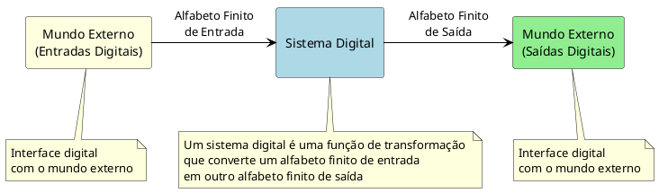

# O conceito, representação e projeto de sistemas digitais

Os diferentes procedimentos envolvidos no projeto de um sistema digital serão discutidos ao longo deste capítulo, com ênfase na tradução de um algoritmo em uma estrutura capaz de implementar o sistema digital. Inicia-se por uma revisão da implementação de máquinas de estados finitos, seguida pelo modelamento de um sistema digital como uma cooperação entre uma Parte Operativa e uma Parte de Controle. A seguir, os diferentes aspectos da construção de cada uma delas são comentados.

## 1 Conceito

Um sistema digital pode ser visto como uma função de transformação de um alfabeto finito de entrada em outro alfabeto finito de saída, como mostra a figura 1. Desde que a interface entre o sistema digital e o mundo externo seja digital, do ponto de vista do sistema o mundo é também ele digital.

Da ideia do comportamento do sistema até sua completa realização física uma série de passos podem ser tomados. Pode-se começar, por exemplo, pela escolha de um algoritmo a ser utilizado para o sistema em questão, seguindo pela definição de um fluxograma de descrição de operações do hardware, a partir do qual se podem realizar simulações e otimizações, obtendo-se os componentes do sistema digital.


<figure>



<figcaption>O conceito de sistema digital</figcaption>
</figure>


## 2 Máquinas de estados finitos

Uma ferramenta natural para projeto de sistemas digitais é o uso de máquinas de estados finitos. O processo clássico de projeto é bastante simples, bastando seguir-se a sequência de passos relacionada adiante. Para exemplificação do processo de projeto será desenvolvido um reconhecedor de sequências de dois bits em 1. Por exemplo, para a entrada `010110111`, a sequência de saída será `000010011`.

### 2.1 ESPECIFICAÇÃO DO COMPORTAMENTO

Tradicionalmente, para descrever o comportamento de uma máquina de estados utiliza-se o diagrama de transição de estados, como mostra a figura 2. O diagrama nada mais é que um auxiliar para melhor visualização das transições entre estados. O diagrama esconde em si uma tabela de transição de estados, como a tabela 1. Observe-se que, nesta fase do projeto, os estados são definidos com nomes simbólicos. Como se pode verificar na tabela 1, a saída depende apenas do estado atual e, portanto, a máquina projetada é uma máquina Moore.

<figure>

```plantuml {kroki=true}
digraph FSM {
    // Configurações gerais do grafo
    rankdir=LR;
    size="8,5";
    node [shape = circle, fontname = "Arial", fontsize = 14, style = filled, fillcolor = lightblue];
    edge [fontname = "Arial", fontsize = 12];
    
    
    // Estados da máquina
    node [shape = circle, fillcolor = lightblue];
    A [label = "A (00)\nSaída=0"];
    B [label = "B (01)\nSaída=0"];
    C [label = "C (10)\nSaída=0"];
    D [label = "D (11)\nSaída=1", fillcolor = lightgreen];
    
    // Transições
    A -> A [label = "Iniciar=0, X"];
    A -> B [label = "Iniciar=1, X"];
    
    B -> B [label = "X, Bit=0"];
    B -> C [label = "X, Bit=1"];
    
    C -> B [label = "X, Bit=0"];
    C -> D [label = "X, Bit=1"];
    
    D -> B [label = "X, Bit=0"];
    D -> D [label = "X, Bit=1"];
    
    // Anotações
    {
        node [shape = note, fillcolor = lightyellow, style = filled];
        note_A [label = "Estado inicial"];
        note_D [label = "Reconheceu dois\nbits 1 consecutivos"];
        
        // Conectar anotações aos estados
        note_A -> A [style = dotted, arrowhead = none];
        note_D -> D [style = dotted, arrowhead = none];
    }
}

```

<figcaption>Diagrama de Transição de Estados - Reconhecedor de Sequências de Dois Bits em 1</figcaption>
</figure>


| Estado | Codificação | Iniciar | Bit de entrada | Próximo estado | Saída |
| ------ | ----------- | ------- | -------------- | -------------- | ----- |
| A      | 00          | 0       | X              | A              | 0     |
| A      | 00          | 1       | X              | B              | 0     |
| B      | 01          | X       | 0              | B              | 0     |
| B      | 01          | X       | 1              | C              | 0     |
| C      | 10          | X       | 0              | B              | 0     |
| C      | 10          | X       | 1              | D              | 0     |
| D      | 11          | X       | 0              | B              | 1     |
| D      | 11          | X       | 1              | D              | 1     |

: Transição de estados

### 2.2 ATRIBUIÇÃO DE ESTADOS

Uma vez definidos os estados pelos quais a máquina deve passar em função das entradas e do estado atual, deve-se proceder à nomeação correta dos estados, ou seja, cada estado deverá possuir um único código binário. A nomeação de estados possui implicações no custo final da máquina, já que uma codificação eficiente pode economizar recursos. Nem sempre a codificação visa a economia. Pode-se estar interessado, por vezes, em confiabilidade, pela adoção de um código de correção de erros. Nesse caso, é provável que o custo da máquina seja maior, mas em operações críticas (como recepção de sinais por satélite, por exemplo) este pode não ser o gargalo do projeto. A segunda coluna da tabela 1 apresenta uma possível codificação de estados para o exemplo do reconhecedor de sequências de bits em 1.

#### 2.2.1 Análise da Máquina de Estados

Exemplificando como a maquina de estado proposta analisa a entrada `010110111` e tem como saída `000010011`.

Esta máquina é um reconhecedor de sequências de dois bits 1 consecutivos, sendo assim, ela produz saída 1 apenas quando detecta dois bits 1 seguidos, caso contrário, produz saída 0.

- Estado A (00): Estado inicial, saída = 0
- Estado B (01): Após iniciar ou após um bit 0, saída = 0
- Estado C (10): Após detectar um bit 1, saída = 0
- Estado D (11): Após detectar dois bits 1 consecutivos, saída = 1

Para se familiarizar com o processo, vamos analisar inicialmente o processamento da sequência de bist `00001100`

1. **Início:** Estado A (00), Saída = 0
   - Sinal Iniciar = 1 → Transição para Estado B (01)
1. **Bit 1 = 0:** Estado B (01), Saída = 0
   - Entrada = 0 → Permanece no Estado B (01)
1. **Bit 2 = 0:** Estado B (01), Saída = 0
   - Entrada = 0 → Permanece no Estado B (01)
1. **Bit 3 = 0:** Estado B (01), Saída = 0
   - Entrada = 0 → Permanece no Estado B (01)
1. **Bit 4 = 0:** Estado B (01), Saída = 0
   - Entrada = 0 → Permanece no Estado B (01)
1. **Bit 5 = 1:** Estado B (01), Saída = 0
   - Entrada = 1 → Transição para Estado C (10)
1. **Bit 6 = 1:** Estado C (10), Saída = 0
   - Entrada = 1 → Transição para Estado D (11)
1. **Bit 7 = 0:** Estado D (11), Saída = 1
   - Entrada = 0 → Transição para Estado B (01)
1. **Bit 8 = 0:** Estado B (01), Saída = 0
   - Entrada = 0 → Permanece no Estado B (01)

| Passo  | Bit de Entrada | Estado Atual | Próximo Estado | Saída |
| ------ | -------------- | ------------ | -------------- | ----- |
| Início | (Iniciar=1)    | A (00)       | B (01)         | 0     |
| 1      | 0              | B (01)       | B (01)         | 0     |
| 2      | 0              | B (01)       | B (01)         | 0     |
| 3      | 0              | B (01)       | B (01)         | 0     |
| 4      | 0              | B (01)       | B (01)         | 0     |
| 5      | 1              | B (01)       | C (10)         | 0     |
| 6      | 1              | C (10)       | D (11)         | 0     |
| 7      | 0              | D (11)       | B (01)         | 1     |
| 8      | 0              | B (01)       | B (01)         | 0     |


: Resumo das transições e saídas do processamento da sequência `00001100`


Agora vamos analisar bit a bit, o processamento da sequência  `010110111`, assumindo que o sinal "Iniciar" é ativado no início:

1. **Início:** Estado A (00), Saída = 0
   - Sinal Iniciar = 1 → Transição para Estado B (01)
1. **Bit 1 = 0:** Estado B (01), Saída = 0
   - Entrada = 0 → Permanece no Estado B (01)
1. **Bit 2 = 1:** Estado B (01), Saída = 0
   - Entrada = 1 → Transição para Estado C (10)
1. **Bit 3 = 0:** Estado C (10), Saída = 0
   - Entrada = 0 → Transição para Estado B (01)
1. **Bit 4 = 1:** Estado B (01), Saída = 0
   - Entrada = 1 → Transição para Estado C (10)
1. **Bit 5 = 1:** Estado C (10), Saída = 0
   - Entrada = 1 → Transição para Estado D (11)
1. **Bit 6 = 0:** Estado D (11), Saída = 1
   - Entrada = 0 → Transição para Estado B (01)
1. **Bit 7 = 1:** Estado B (01), Saída = 0
   - Entrada = 1 → Transição para Estado C (10)
1. **Bit 8 = 1:** Estado C (10), Saída = 0
   - Entrada = 1 → Transição para Estado D (11)
1. **Bit 9 = 1:** Estado D (11), Saída = 1
   - Entrada = 1 → Permanece no Estado D (11)


| Passo  | Bit de Entrada | Estado Atual | Próximo Estado | Saída |
| ------ | -------------- | ------------ | -------------- | ----- |
| Início | (Iniciar=1)    | A (00)       | B (01)         | 0     |
| 1      | 0              | B (01)       | B (01)         | 0     |
| 2      | 1              | B (01)       | C (10)         | 0     |
| 3      | 0              | C (10)       | B (01)         | 0     |
| 4      | 1              | B (01)       | C (10)         | 0     |
| 5      | 1              | C (10)       | D (11)         | 0     |
| 6      | 0              | D (11)       | B (01)         | 1     |
| 7      | 1              | B (01)       | C (10)         | 0     |
| 8      | 1              | C (10)       | D (11)         | 0     |
| 9      | 1              | D (11)       | D (11)         | 1     |

: Resumo das transições e saídas do processamento da sequência `010110111`

Portanto, para a entrada `010110111`, a saída gerada é `000010011`, que corresponde exatamente ao resultado esperado: a máquina produz 1 apenas quando detecta dois bits 1 consecutivos (posições 6 e 9).


### 2.3 ESPECIFICAÇÃO E MINIMIZAÇÃO DAS EQUAÇÕES DE TRANSIÇÃO

Uma vez que a máquina esteja completamente caracterizada na tabela de transição, basta escolher os flip-flops desejados e proceder-se à montagem do circuito. Embora o uso de flip-flops $JK$ possa produzir uma lógica mais compacta, modernamente o uso de circuitos integrados dedicados e de lógica programável favorece o flip-flop tipo $D$, pela facilidade de projeto da equação de próximo estado. Como se tem 4 estados, são necessários 2 flip-flops. Como a função de transição de um flip-flop tipo $D$ é $Q^{n+1}=D$, onde $n$ é o estado atual, observando-se a tabela 1 pode-se escrever:

$$D_1 = Q_0 \cdot bit + Q_1 \cdot bit \tag{1}$$

$$D_0 = Q_0 \cdot /bit + /Q_0 \cdot iniciar + Q_1 \cdot /Q_0 + Q_1 \cdot bit \tag{2}$$

Onde $/bit$ significa o sinal de $bit$ negado, ou seja, a expressão é verdadeira quando o sinal vale zero lógico.

Além disto, como a saída depende apenas do estado atual, observando-se a tabela 1 escreve-se diretamente:

$$Saída = Q_1 \cdot Q_0 \tag{3}$$

Pode-se minimizar a função de transição de estados e a função de saída pelo uso de mapas de Karnaugh. Este passo é fundamental para economia de recursos, mas extremamente cansativo e sujeito a erros para o caso de mapas de 5 ou mais variáveis. Mesmo a minimização através de programas de computador pode ser problemática para um número razoável de variáveis. Além disso, a assinalação de estados tem um papel importante na minimização total da função. Caso o estado C fosse codificado como 11 e o estado D como 01, a equação do próximo estado dos flip-flops seria alterada. Neste caso, D₂ seria modificado para:

$$D_0 = /Q_1 \cdot iniciar + /Q_1 \cdot Q_0 + Q_1 \cdot /bit \tag{4}$$

diminuindo-se um termo da equação (2).

## 3 O modelo PC-PO

Embora útil e simples, o modelo de uma única máquina de estados é ineficiente quando sistemas mais complexos devem ser projetados. Por exemplo, o número de estados possíveis de serem alcançados em um microprocessador é enorme, o que inviabiliza seu projeto utilizando-se este modelo mais simples.

Do ponto de vista de arquitetura de circuitos, um sistema digital será visto como uma cooperação entre dois blocos, a Parte Operativa e a Parte de Controle, como representado na figura 3. A Parte Operativa (PO, ou também Bloco Operativo) contém um conjunto de registradores, operadores e conexões que realizam as computações necessárias (somas, subtrações, deslocamentos, operações lógicas, etc.). A Parte de Controle (PC) é a responsável pela sequência correta de operações da Parte Operativa, selecionando a rede de conexões, os registradores e os operadores que devem atuar em cada passo do algoritmo.


<figure>


```plantuml {kroki=true}
digraph Diagrama {
    splines=ortho; // Linhas ortogonais
    layout=neato; // Necessário para respeitar as posições
    
    node [shape=box, style="filled", fillcolor=lightgrey, fontname="Arial", fontsize=12];
    
    PC [pos="5,0!",shape=plaintext, width=1.5, height=1.5,label=<
        <table border="0" cellborder="0" cellspacing="0">
            <tr><td align="center"><b>PC</b></td></tr>
            <tr><td align="left">FSM</td></tr>
        </table>
    >];


    // Nó com formatação rica
    PO [pos="0,0!",shape=plaintext, width=1.5, height=1.5 ,label=<
        <table border="0" cellborder="0" cellspacing="0">
            <tr><td align="center"><b>PO</b></td></tr>
            <tr><td align="left">Operadores</td></tr>
            <tr><td align="left">Registradores</td></tr>
            <tr><td align="left">Conexões</td></tr>
        </table>
    >];

    R [pos="2.5,-2!", label="Relógio"]

    R -> PC;
    R -> PO;
    PO -> PC [label="STATUS"];
    PC -> PO [label="COMANDOS"];

    // Nó invisível
    // X [style=invis];
    X [pos="-2,0!",style=invis]
    X -> PO [label="  E/S",dir=both]
    Y [pos="7,0!",style=invis]
    Y -> PC [label="  E/S",dir=both]

}
```


<figcaption>Modelo PC-PO</figcaption>
</figure>


Os sinais que saem da PC em direção à PO são considerados como comandos, responsáveis pela seleção de caminhos e operações a serem executadas na PO. Os sinais que chegam à PC vindos da PO são as condições ou status, e significam os resultados de computações que servirão para a troca de estados da Parte de Controle.

Esta divisão de um sistema em Parte Operacional e Bloco de Controle é tão complexa e recursiva quanto se queira. Por exemplo, em um controle de motor, o motor é o bloco operacional, enquanto o microprocessador é o bloco de controle. O microprocessador em si possui um bloco de controle e outro operativo, e sucessivamente.

A representação de um sistema digital pode ser feita das mais diversas maneiras. Presentemente, linguagens de descrição de hardware como VHDL são praticamente um padrão a ser seguido pelos projetistas de sistemas digitais. Antes do uso de linguagens de descrição de hardware para síntese automática de circuitos, tema que será visto no próximo capítulo, é importante saber-se como, a partir de uma especificação de um algoritmo, pode-se chegar à realização física do sistema digital.

Por exemplo, tome-se o caso de um circuito que deve realizar a multiplicação entre dois números inteiros sem sinal de 8 bits. Existem várias possibilidades de implementação de multiplicadores, mas a escolha recaiu sobre o algoritmo da equação 5.

$$M = \sum_{i=0}^{B} A \tag{5}$$

Para auxiliar na passagem da especificação (algoritmo da equação 5) a em circuito real, pode-se fazer uso de um fluxograma como o da figura 4, criando variáveis livremente. Com o fluxograma é possível simular o sistema traduzindo-se o diagrama para alguma linguagem de programação, como C ou Matlab, respectivamente nas figuras 5 e 6. Ao mesmo tempo, seguindo-se algumas regras básicas, do fluxograma serão obtidos os blocos operativos e de controle. Pode-se alterar o fluxograma de modo a obter o máximo paralelismo de operações, ou o mínimo uso de variáveis. Estes critérios são frequentemente conflitantes, e a opção entre um ou outro será função da arte de projeto.

**Figura 4** - Fluxograma do algoritmo de multiplicação

**Figura 5** - Descrição do algoritmo em linguagem C

**Figura 6** - Descrição do algoritmo em Matlab

Por exemplo, a partir do fluxograma do multiplicador, pode-se obter um bloco de controle onde cada estado do fluxograma corresponderá a um estado no controle. Embora facilmente compreensível, esse método de projeto leva a desperdício de recursos do bloco operativo e do próprio bloco de controle. Portanto, transformações no fluxograma de entrada podem e devem ser feitas com o objetivo de se atingir um sistema digital mais rápido ou mais econômico que o disponível pela solução inicial.

Note-se que o fluxograma já possui operações eletricamente factíveis do ponto de vista de sistemas digitais. Considera-se uma operação eletricamente factível como aquela que consome um ciclo de relógio, como uma soma, subtração, operações lógicas (and, or, not), deslocamento à esquerda ou à direita, etc. Operações multiciclos (como uma divisão ou uma transformada rápida de Fourier, por exemplo) podem ser tratadas como subrotinas ou como módulos operativos mais complexos.

Existem métodos para identificação da Parte Operativa e da Parte de Controle a partir da especificação algorítmica original. Contudo, nesse nível de abstração, a decisão entre o que será PC e o que será PO é muito interdependente. Por exemplo, a sequência do fluxograma ACC=ACC+A; BR=BR-1 pode ser feita em paralelo, com o custo de ser necessário um somador e um subtrator. Se feita em sequência, somente uma unidade de lógica e aritmética (ULA) é necessária, mas haverá a necessidade de dois estados na máquina de controle, pela serialização das operações.

O uso de linguagens de programação como Matlab ou C para simulação do fluxograma é plenamente factível, e foi um método largamente utilizado durante a década de 80. É preciso, porém, considerar as limitações próprias das linguagens procedurais para descrever o hardware. Programas de computador são sequenciais, enquanto o hardware é naturalmente paralelo, já que todos os transistores do circuito são alimentados. Outra diferença significativa refere-se ao tamanho dos dados. No caso de blocos operativos de 8 bits não existe problema, mas a simulação de Partes Operativas de 64 bits pode ser difícil, devido a definição incorreta de inteiros do compilador em uso. Além disso, operações simples como um deslocamento podem exigir muitas operações em Matlab, requerendo muito processamento auxiliar. De qualquer modo, recomenda-se vivamente a simulação de algoritmos antes de sua implementação, até para validação de idéias inovadoras. Presentemente, com o crescimento da complexidade do projeto, linguagens procedurais têm sido utilizadas novamente no contexto de co-projeto de hardware e software.

Uma diferença fundamental entre uma descrição de hardware através de uma linguagem de programação e o hardware em si é o custo de conexões. Durante a simulação, um fio ou uma ligação entre uma variável ou outra é gratuita. Isto não reflete a realidade dos circuitos, em que conectores e espaço em placa são custosos, às vezes tão ou mais caros que a maioria dos componentes eletrônicos utilizados no projeto.

A temporização ou o atraso dos componentes envolvidos no projeto está escondida, quando se utiliza uma linguagem de alto nível para simulação. O atraso de uma porta é igual a toda uma Unidade de Lógica e Aritmética (ULA); os registradores podem ser sensíveis a borda ou não. Embora isso seja um problema aparente, uma metodologia sólida de projeto permitirá a postecipação desses detalhes para outros estágios de desenvolvimento sem comprometer a solução final.

As otimizações da Parte Operativa e da Parte de Controle serão estudadas detalhadamente a seguir. Contudo, é importante lembrar que uma boa otimização passa por uma boa escolha do algoritmo de partida. No caso, o algoritmo por somas sucessivas dependente do multiplicando é altamente ineficiente (2*255 leva um tempo diferente e bem maior que 255*2). Os programas de projeto auxiliado por computador (Computer Aided Design, CAD) hoje disponíveis realizam automaticamente os blocos operativos e de controle, mas não podem escolher o melhor algoritmo, que é função única e exclusiva do projetista. Uma das funções do projeto automatizado é permitir a investigação de vários algoritmos, até que se encontre um que atenda as especificações do projeto, ou que otimize o projeto sob algum parâmetro.

## 4 O projeto do bloco operacional

