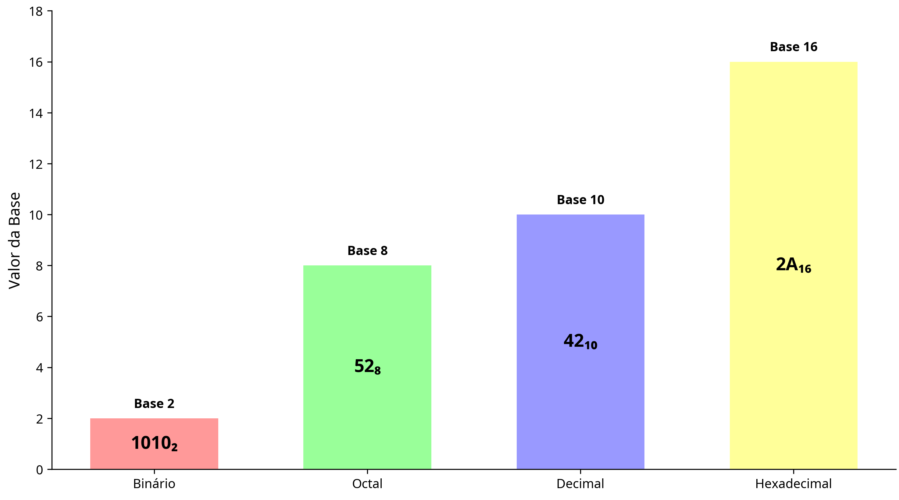
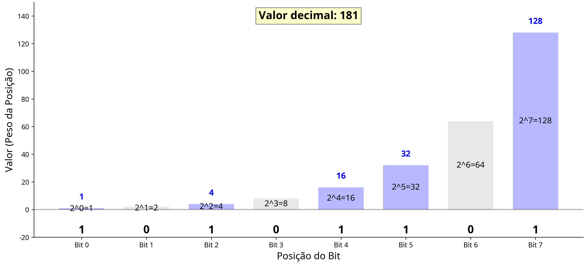

# Sistemas de Numeração e Sistema Binário

## Introdução aos Sistemas de Numeração

Os sistemas de numeração são métodos utilizados para representar quantidades através de símbolos. Ao longo da história, diferentes civilizações desenvolveram seus próprios sistemas para representar números, cada um com características específicas que refletem as necessidades e o contexto cultural de cada época.

No mundo da computação e dos sistemas digitais, compreender diferentes sistemas de numeração é fundamental, pois os computadores não processam informações da mesma forma que nós, humanos. Enquanto estamos acostumados a utilizar o sistema decimal (base 10) em nosso dia a dia, os computadores operam fundamentalmente com o sistema binário (base 2).


## Sistemas de Numeração Posicional

Os sistemas de numeração que utilizamos atualmente são chamados de sistemas posicionais. Isso significa que o valor de um dígito depende não apenas do símbolo utilizado, mas também da posição que ele ocupa no número. Por exemplo, no número decimal 123, o dígito "1" representa uma centena (10²), o "2" representa duas dezenas (10¹) e o "3" representa três unidades (10⁰).

### Características de um Sistema de Numeração Posicional:

1. **Base**: Número de símbolos distintos utilizados no sistema.
2. **Símbolos**: Conjunto de caracteres utilizados para representar quantidades.
3. **Valor posicional**: O valor de um dígito depende da sua posição no número.
4. **Peso**: Cada posição tem um peso associado, que é uma potência da base.

## Principais Sistemas de Numeração



### Sistema Decimal (Base 10)

::: important Sistema Decimal (Base 10)

**Símbolos**: 0, 1, 2, 3, 4, 5, 6, 7, 8, 9
**Exemplo**: 18724

:::


O sistema decimal é o mais familiar para nós, pois é o que utilizamos no cotidiano. Ele utiliza 10 símbolos distintos: 0, 1, 2, 3, 4, 5, 6, 7, 8 e 9.

**Exemplo**: O número decimal 425 pode ser interpretado como:
- 4 × 10² = 4 × 100 = 400
- 2 × 10¹ = 2 × 10 = 20
- 5 × 10⁰ = 5 × 1 = 5
- Total: 400 + 20 + 5 = 425

### Sistema Binário (Base 2)

O sistema binário utiliza apenas dois símbolos: 0 e 1. É o sistema fundamental para a computação, pois os circuitos eletrônicos podem facilmente representar dois estados: ligado (1) ou desligado (0).


::: tip Sistema Binário (Base 2)

**Símbolos**: 0, 1

**Exemplo**: 10101~2~


:::


**Exemplo**: O número binário 1011~2~ pode ser interpretado como:
- 1 × 2³ = 1 × 8 = 8
- 0 × 2² = 0 × 4 = 0
- 1 × 2¹ = 1 × 2 = 2
- 1 × 2⁰ = 1 × 1 = 1
- Total: 8 + 0 + 2 + 1 = 11 (em decimal)

Outro exemplo



### Sistema Octal (Base 8)

O sistema octal utiliza 8 símbolos: 0, 1, 2, 3, 4, 5, 6 e 7.

::: warning Sistema Octal (Base 8)

**Símbolos**: 0, 1, 2, 3, 4, 5, 6, 7
**Exemplo**: 7634~8~

:::

**Exemplo**: O número octal 347~8~ pode ser interpretado como:
- 3 × 8² = 3 × 64 = 192
- 4 × 8¹ = 4 × 8 = 32
- 7 × 8⁰ = 7 × 1 = 7
- Total: 192 + 32 + 7 = 231 (em decimal)

### Sistema Hexadecimal (Base 16)

O sistema hexadecimal utiliza 16 símbolos: 0, 1, 2, 3, 4, 5, 6, 7, 8, 9, A, B, C, D, E e F, onde A representa 10, B representa 11, e assim por diante até F, que representa 15.

::: info Sistema Hexadecimal (Base 16)

**Símbolos**: 0, 1, 2, 3, 4, 5, 6, 7, 8, 9, A, B, C, D, E, F
**Exemplo**: AB43~16~

:::


**Exemplo**: O número hexadecimal 2AF pode ser interpretado como:
- 2 × 16² = 2 × 256 = 512
- A (10 em decimal) × 16¹ = 10 × 16 = 160
- F (15 em decimal) × 16⁰ = 15 × 1 = 15
- Total: 512 + 160 + 15 = 687 (em decimal)

## Conversão Entre Sistemas de Numeração

<NumberConverter />

### Conversão de Decimal para Outra Base

Para converter um número decimal para outra base, dividimos sucessivamente o número pela base desejada, anotando os restos das divisões. O número na nova base é formado pelos restos lidos de baixo para cima.

**Exemplo**: Conversão de 42 (decimal) para binário:
- 42 ÷ 2 = 21, resto 0
- 21 ÷ 2 = 10, resto 1
- 10 ÷ 2 = 5, resto 0
- 5 ÷ 2 = 2, resto 1
- 2 ÷ 2 = 1, resto 0
- 1 ÷ 2 = 0, resto 1
- Resultado: 101010 (binário)

### Conversão de Outra Base para Decimal

Para converter um número de qualquer base para decimal, multiplicamos cada dígito pelo valor da base elevado à potência correspondente à posição do dígito, e somamos todos os resultados.

**Exemplo**: Conversão de 1101 (binário) para decimal:
- 1 × 2³ = 1 × 8 = 8
- 1 × 2² = 1 × 4 = 4
- 0 × 2¹ = 0 × 2 = 0
- 1 × 2⁰ = 1 × 1 = 1
- Total: 8 + 4 + 0 + 1 = 13 (decimal)

### Conversão Direta Entre Bases Não Decimais

Para converter entre bases não decimais (por exemplo, de binário para hexadecimal), geralmente é mais fácil usar o decimal como intermediário. No entanto, existem alguns atalhos úteis:

#### Binário para Octal

Agrupe os dígitos binários em grupos de 3, da direita para a esquerda, e converta cada grupo para o dígito octal correspondente.

##### Exemplo:

Vamos converter o número binário 1011011~2~ para octal:

Agrupando em grupos de 3 (da direita para a esquerda): 10 | 110 | 011
Completando com zeros à esquerda no primeiro grupo: 010 | 110 | 011
Convertendo cada grupo para octal:
010 = 2 (em octal)
110 = 6 (em octal)
011 = 3 (em octal)

Resultado: 263~8~ (octal)


#### Binário para Hexadecimal

Agrupe os dígitos binários em grupos de 4, da direita para a esquerda, e converta cada grupo para o dígito hexadecimal correspondente.

##### Exemplo:
Conversão de 1011010 (binário) para hexadecimal:
- Agrupando em grupos de 4: 101 1010
- Completando com zeros à esquerda: 0101 1010
- Convertendo cada grupo: 0101 = 5, 1010 = A
- Resultado: 5A~16~ (hexadecimal)

## O Sistema Binário em Detalhes

O sistema binário é a base de toda a computação moderna. Vamos explorar mais a fundo suas características e aplicações.


### Por que o Sistema Binário é Usado em Computadores?

1. **Simplicidade**: Com apenas dois estados (0 e 1), é fácil representar informações usando componentes eletrônicos que podem estar em um de dois estados (ligado/desligado).
2. **Confiabilidade**: A distinção entre dois estados é mais robusta contra ruídos e interferências do que sistemas com mais estados.
3. **Facilidade de implementação**: Circuitos digitais que operam com dois estados são mais simples de projetar e fabricar.

### Representação de Informações em Binário

#### Bit e Byte

- **Bit**: A menor unidade de informação em um sistema digital, que pode assumir apenas um de dois valores: 0 ou 1.
- **Byte**: Um conjunto de 8 bits, capaz de representar 2⁸ = 256 valores diferentes (de 0 a 255).

### Operações Aritméticas em Binário

#### Adição Binária

A adição binária segue regras simples:
- 0 + 0 = 0
- 0 + 1 = 1
- 1 + 0 = 1
- 1 + 1 = 10 (0 com carry 1)

**Exemplo**:
```
  1 1 1 (carry)
  1 0 1 1
+ 0 1 0 1
---------
1 0 0 0 0
```

#### Subtração Binária

A subtração binária pode ser realizada diretamente ou utilizando o complemento de 2:
- 0 - 0 = 0
- 1 - 0 = 1
- 1 - 1 = 0
- 0 - 1 = 1 (com borrow 1)

**Exemplo usando complemento de 2**:
Para calcular 7 - 3:
- 7 em binário: 0111
- 3 em binário: 0011
- Complemento de 2 de 3: 1101
- 0111 + 1101 = 0100 (ignorando o carry)
- Resultado: 0100 = 4 em decimal


## Aplicações do Sistema Binário

### Codificação de Caracteres

Os caracteres de texto são representados em computadores através de códigos binários. Alguns padrões comuns incluem:

- **ASCII**: Utiliza 7 bits para representar 128 caracteres diferentes, incluindo letras, números e símbolos.
- **Unicode**: Estende o ASCII para incluir caracteres de praticamente todos os sistemas de escrita do mundo, utilizando mais bits por caractere.

### Representação de Imagens

As imagens digitais são compostas por pixels, cada um representado por um conjunto de bits que definem sua cor. Por exemplo:

- **Imagem em preto e branco**: Cada pixel pode ser representado por 1 bit (0 para preto, 1 para branco).
- **Escala de cinza**: Cada pixel pode ser representado por vários bits para indicar diferentes níveis de cinza.
- **Imagem colorida**: Cada pixel é representado por bits que definem as intensidades de vermelho, verde e azul (RGB).

### Representação de Áudio

O áudio digital é representado através da amostragem do sinal sonoro em intervalos regulares, com cada amostra sendo convertida em um valor binário.

## Conclusão

Os sistemas de numeração, especialmente o sistema binário, são fundamentais para a computação e os sistemas digitais. Compreender como esses sistemas funcionam e como realizar conversões entre eles é essencial para qualquer pessoa que deseje trabalhar com tecnologia digital.

Na próxima aula, exploraremos as funções e portas lógicas, que são os blocos básicos de construção dos circuitos digitais, e veremos como eles utilizam o sistema binário para realizar operações lógicas.

## Exercícios Propostos

1. Converta os seguintes números decimais para binário:
   a) 25
   b) 42
   c) 127
   d) 255

2. Converta os seguintes números binários para decimal:
   a) 1010
   b) 11011
   c) 10101010
   d) 11111111

3. Realize as seguintes operações em binário:
   a) 1011 + 1101
   b) 10110 - 1101   

4. Converta os seguintes números:
   a) 42 (decimal) para hexadecimal
   b) A7 (hexadecimal) para decimal
   c) 1101 0111 (binário) para octal
   d) 753 (octal) para binário

[Link para entrega](https://classroom.github.com/a/_sPMQ8WQ)
