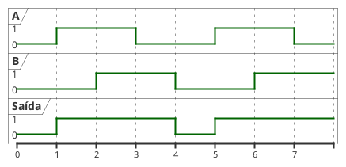
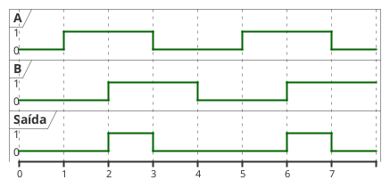

---
icon: edit  
date: 2025-04-22 10:20:00.00 -3  
category:  
   - aula  
   - exercicio  
   - entrega
order: 4
---  

# Portas Lógicas 

Já  vimos  que  uma  função  Booleana  pode  ser  representada  por  uma  equação  ou detalhada pela sua tabela verdade. Mas uma função Booleana também pode ser representada de forma gráfica, onde cada operador está associado a um símbolo específico, permitindo o imediato reconhecimento visual. Tais símbolos são conhecidos por portas lógicas. 

Na   realidade,   mais   do   que   símbolos   de   operadores   lógicos,   as   portas   lógicas representam  recursos  físicos,  isto  é,  circuitos  eletrônicos,  capazes  de  realizar  as  operações lógicas. Na eletrônica que trabalha com somente dois estados, a qual é denominada eletrônica digital, o nível lógico 0 normalmente está associado à ausência de tensão (0 volt) enquanto o nível  lógico  1,  à  presença  de  tensão  (a  qual  geralmente  é  5  volts).  Nesta  disciplina,  nos limitaremos  ao  mundo  da  álgebra  Booleana,  admitindo  que  as  portas  lógicas  representam também  circuitos  eletrônicos  que,  de  alguma  maneira,  realizam  as  funções  Booleanas simbolizadas.  Então,  ao  conjunto  de  portas  lógicas  e  respectivas  conexões  que  simbolizam uma equação Booleana, denominaremos circuito lógico. 


## Porta OU 


O símbolo da porta OU pode ser visto na abaixo. Tal como na porta E, as entradas são colocadas à esquerda e a saída, à direita. Deve haver no mínimo duas entradas, mas há somente uma saída. O funcionamento da porta E segue a definição da operação E, dada em [Álgebra Booleana e Circuitos Lógicos](03_Booleana.md)

<figure>

<div class=multicolumn>


```upmath
\usetikzlibrary {circuits.logic.US}
\begin{tikzpicture}[circuit logic US]
  \matrix[column sep=5mm]
  {
    \node (i0) {A}; &                            & \\
                    & \node [or gate] (a1) {};  &  \node (out) {A+B}; \\
    \node (i1) {B}; &                            & \\
  };
  \draw (i0.east) -- ++(right:3mm) |- (a1.input 1);
  \draw (i1.east) -- ++(right:3mm) |- (a1.input 2);
  \draw (a1.output) -- ++(right:2mm) |- (out.west);
\end{tikzpicture}
```


```upmath
\usetikzlibrary {circuits.logic.US}
\begin{tikzpicture}[circuit logic US]
  \matrix[column sep=5mm]
  {
    \node (i0) {A}; &                            & \\
    \node (i1) {B};  & \node [or gate US, draw,logic gate inputs=nnn] (a1) {};  &  \node (out) {A+B+C}; \\
    \node (i2) {C}; &                            & \\
  };
  \draw (i0.east) -- ++(right:3mm) |- (a1.input 1);
  \draw (i1.east) -- ++(right:3mm) |- (a1.input 2);
  \draw (i2.east) -- ++(right:3mm) |- (a1.input 3);
  \draw (a1.output) -- ++(right:2mm) |- (out.west);
\end{tikzpicture}
```

</div>

<figcaption>Símbolo da porta lógica OU com 2 entradas e com 3 entradas.
</figcaption>
</figure>

<figure>




<figcaption>Funcionamento da porta OU com o sinal variando com o tempo</figcaption>
</figure>

## Porta E 


O símbolo da porta E é mostrado na figura abaixo. À esquerda estão dispostas as entradas (no  mínimo  duas,  obviamente)  e  à  direita,  a  saída  (única).  As  linhas  que  conduzem  as variáveis  de  entrada  e  saída  podem  ser  interpretadas  como  fios  que  transportam  os  sinais elétricos associados às variáveis. O comportamento da porta E segue estritamente a definição (e tabela verdade) dada em [Álgebra Booleana e Circuitos Lógicos](03_Booleana.md)


<figure>

<div class=multicolumn>


```upmath
\usetikzlibrary {circuits.logic.US}
\begin{tikzpicture}[circuit logic US]
  \matrix[column sep=5mm]
  {
    \node (i0) {A}; &                            & \\
                    & \node [and gate] (a1) {};  &  \node (out) {A.B}; \\
    \node (i1) {B}; &                            & \\
  };
  \draw (i0.east) -- ++(right:3mm) |- (a1.input 1);
  \draw (i1.east) -- ++(right:3mm) |- (a1.input 2);
  \draw (a1.output) -- ++(right:2mm) |- (out.west);
\end{tikzpicture}
```


```upmath
\usetikzlibrary {circuits.logic.US}
\begin{tikzpicture}[circuit logic US]
  \matrix[column sep=5mm]
  {
    \node (i0) {A}; &                            & \\
    \node (i1) {B}; & \node [and gate US, draw,logic gate inputs=nnn] (a1) {};  &  \node (out) {A.B.C}; \\
    \node (i2) {C}; &                            & \\
  };
  \draw (i0.east) -- ++(right:3mm) |- (a1.input 1);
  \draw (i1.east) -- ++(right:3mm) |- (a1.input 2);
  \draw (i2.east) -- ++(right:3mm) |- (a1.input 3);
  \draw (a1.output) -- ++(right:2mm) |- (out.west);
\end{tikzpicture}
```


</div>


<figcaption>Símbolo da porta lógica E com 2 entradas  e com 3 entradas </figcaption>
</figure>


<figure>




<figcaption>Funcionamento da porta E com o sinal variando com o tempo</figcaption>
</figure>


## Inversor (ou Porta Inversora, ou Negador) 

A porta que simboliza a operação  complementação é conhecida como  inversor (ou porta inversora, ou negador). Como a operação complementação só pode ser realizada sobre uma variável por vez (ou sobre o resultado de uma  subexpressão), o inversor só possui uma entrada e, obviamente, uma saída. Caso se queira complementar uma expressão, é necessário obter-se primeiramente o seu resultado, para só então aplicar a complementação. O símbolo do inversor é mostrado na figura abaixo 

<figure>

```upmath
\usetikzlibrary {circuits.logic.US}
\begin{tikzpicture}[circuit logic US]
\matrix[column sep=5mm]
{
\node (i1) {A};  & \node[not gate US, draw] (N);  & \node (out) {\( \overline{A} \)}; \\
};
\draw (i1.east) -- ++(right:5mm) (N.input 1);
\draw (N.output) -- ++(right:5mm) (out.west);
\end{tikzpicture}
```


<figcaption> Símbolo do inversor (também conhecido como negador ou porta inversora</figcaption>
</figure> 

## Circuito Lógico 

Dada uma equação Booleana qualquer, é possível desenhar-se o circuito lógico que a implementa. O circuito lógico é composto das portas lógicas relacionadas às operações que são realizadas sobre as variáveis de entrada. Os resultados das operações são conduzidos por fios, os quais, no desenho, são representados por linhas simples. 

Os passos a serem seguidos para se realizar o desenho do circuito lógico a partir de uma equação são praticamente os mesmos usados na avaliação da expressão. Tomemos como exemplo   a   equação,   avaliada   em [Álgebra Booleana e Circuitos Lógicos](03_Booleana.md).   Inicialmente,   identificamos   as   variáveis independentes,  que  no  caso  são  $X$,  $Y$  e  $Z$.  Para  cada  uma  destas,  traçamos  uma  linha  (da esquerda para a direita), representando os fios que conduzem os valores. Feito isto, deve-se seguir  desenhando  as  portas  necessárias  para  representar  cada  uma  das  subexpressões,  na mesma ordem tomada para a avaliação, ou seja: 

<figure>

```upmath
\usetikzlibrary {circuits.logic.US}
\begin{tikzpicture}[circuit logic US, scale=1, every node/.style={scale=1}]
  % Entradas
  \node (x) at (0,2) {$X$};
  \node (y) at (0,1) {$Y$};
  \node (z) at (0,0) {$Z$};

  % Negador para Z
  \node[not gate US, draw, logic gate inputs=nn] (notz) at (2,0) {};
  \node (zn) at (3,0) {$\overline{Z}$};

  % AND para Y e \overline{Z}
  \node[and gate US, draw, logic gate inputs=nn] (and1) at (4,1) {};
  \node (yandzn) at (5,1) {$Y \cdot \overline{Z}$};

  % OR para X e (Y.\overline{Z})
  \node[or gate US, draw, logic gate inputs=nn] (or1) at (6,1.5) {};
  \node (w) at (7.2,1.5) {$W$};

  % Fios de entrada
  \draw (x.east) -- ++(right:0.7) |- (or1.input 1);
  \draw (y.east) -- (and1.input 1);
  \draw (z.east) --  ++(right:1.6)  (notz.input 1);
  \draw (notz.output) -- (zn.west);
  \draw (zn.east) -- ++(right:0.2) |- (and1.input 2);

  % Saída do AND
  \draw (and1.output) -- (yandzn.west);
  \draw (yandzn.east) -- ++(right:0.1) |- (or1.input 2);

  % Saída final
  \draw (or1.output) -- (w.west);
\end{tikzpicture}
```

<figcaption>Circuito lógico para a equação  W = X + Y . ~Z</figcaption>
</figure>

## Leis Fundamentais e Propriedades da Álgebra Booleana 

As leis da álgebra  Booleana dizem respeito ao espaço  Booleano (isto é., valores que uma variável pode assumir) e operações elementares deste espaço. Já as propriedades podem ser deduzidas a partir das definições das operações. 

Sejam $A$ e $B$ duas variáveis Booleanas. Então, o espaço Booleano é definido: 

::: info
se $A \neq 0$, então $A = 1$

se $A \neq 1$, então $A = 0$
:::

As operações elementares deste espaço são operação `OU`, operação `E` e `complementação` respectivamente. As propriedades da álgebra Booleana são as seguintes. 

- Da adição lógica: 
$$ \tag{1} A + 0 = A $$
$$ \tag{2} A + 1 = 1 $$ 
$$ \tag{3} A + A = A $$ 
$$ \tag{4} A + \overline{A} = 1 $$ 

- Da multiplicação lógica: 

$$ \tag{5} A \cdot 0 = 0 $$
$$ \tag{6} A \cdot 1 = A $$
$$ \tag{7} A \cdot A = A $$
$$ \tag{8} A \cdot \overline{A} = 0 $$

- Complementação: 

$$ \tag{9} \overline{\overline{A}} = A $$

- Comutatividade: 

$$ \tag{10} A + B = B + A $$
$$ \tag{11} A \cdot B = B \cdot A $$

- Associatividade: 

$$ \tag{12} A + (B + C) = (A + B) + C = (A + C) + B  $$
$$ \tag{13} A \cdot (B \cdot C) = (A \cdot B) \cdot C = (A \cdot C) \cdot B $$
 

- Distributiva (da multiplicação em relação à adição): 

$$ \tag{14} A \cdot (B + C) = A \cdot B + A \cdot C$$       

