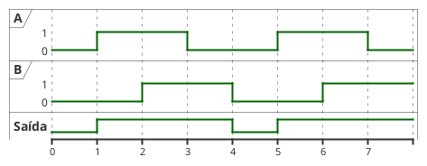
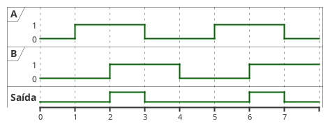
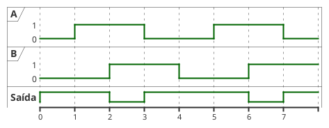
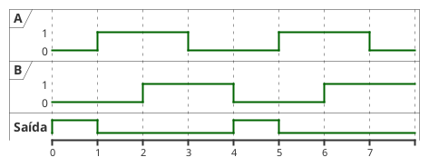

---
icon: pen-to-square  
date: 2025-04-22 10:20:00.00 -3  
category:  
  - aula  
  - exercicio  
order: 4
---  

# Portas Lógicas 

Já vimos que uma função Booleana pode ser representada por uma equação matemática ou detalhada por meio de sua tabela verdade. No entanto, além dessas formas, existe uma representação gráfica muito utilizada, na qual cada operador lógico é associado a um símbolo específico. Essa representação gráfica facilita o entendimento e a análise dos circuitos, pois permite o reconhecimento visual imediato das operações realizadas. Esses símbolos são conhecidos como **portas lógicas**.

Na prática, as portas lógicas não são apenas símbolos em um diagrama: elas correspondem a dispositivos eletrônicos reais, implementados por circuitos eletrônicos capazes de executar operações lógicas. Na eletrônica digital, que trabalha apenas com dois estados possíveis (0 e 1), o nível lógico 0 geralmente está associado à ausência de tensão elétrica (0 volt), enquanto o nível lógico 1 corresponde à presença de tensão (normalmente 5 volts, mas pode variar conforme a tecnologia). Portanto, ao estudarmos portas lógicas, estamos lidando tanto com a representação simbólica das operações da álgebra Booleana quanto com os componentes físicos que as realizam.

Nesta disciplina, focaremos no aspecto lógico das portas, mas é importante lembrar que, em sistemas digitais reais, essas portas são implementadas fisicamente em circuitos integrados. Assim, quando desenhamos um circuito lógico, estamos representando graficamente como as variáveis de entrada são processadas por diferentes portas para produzir uma saída, de acordo com uma determinada função Booleana. O conjunto de portas lógicas e suas conexões, que implementa uma equação Booleana, é chamado de **circuito lógico**.

## Porta OU 

A porta lógica `OR` (OU) realiza a operação lógica de adição (soma lógica). Seu símbolo é mostrado abaixo. Assim como na porta `AND`, as entradas são posicionadas à esquerda e a saída à direita. Uma porta `OR` pode ter duas ou mais entradas, mas sempre possui uma única saída. A saída será 1 se pelo menos uma das entradas for 1; caso contrário, será 0. O funcionamento da porta `OR` segue a definição da operação OU, detalhada em [Álgebra Booleana e Circuitos Lógicos](03_Booleana.md).

<figure>

<div class=multicolumn>

```upmath
\usetikzlibrary {circuits.logic.US}
\begin{tikzpicture}[circuit logic US]
  \matrix[column sep=5mm]
  {
   \node (i0) {A}; &                            & \\
              & \node [or gate] (a1) {};  &  \node (out) {A+B}; \\
   \node (i1) {B}; &                            & \\
  };
  \draw (i0.east) -- ++(right:3mm) |- (a1.input 1);
  \draw (i1.east) -- ++(right:3mm) |- (a1.input 2);
  \draw (a1.output) -- ++(right:2mm) |- (out.west);
\end{tikzpicture}
```

```upmath
\usetikzlibrary {circuits.logic.US}
\begin{tikzpicture}[circuit logic US]
  \matrix[column sep=5mm]
  {
   \node (i0) {A}; &                            & \\
   \node (i1) {B};  & \node [or gate US, draw,logic gate inputs=nnn] (a1) {};  &  \node (out) {A+B+C}; \\
   \node (i2) {C}; &                            & \\
  };
  \draw (i0.east) -- ++(right:3mm) |- (a1.input 1);
  \draw (i1.east) -- ++(right:3mm) |- (a1.input 2);
  \draw (i2.east) -- ++(right:3mm) |- (a1.input 3);
  \draw (a1.output) -- ++(right:2mm) |- (out.west);
\end{tikzpicture}
```

</div>

<figcaption>Símbolo da porta lógica OR com 2 entradas e com 3 entradas.</figcaption>
</figure>

A tabela verdade da porta `OR` mostra que a saída será 1 sempre que pelo menos uma das entradas for 1. Isso significa que a porta `OR` é utilizada em situações onde se deseja detectar a presença de pelo menos um sinal ativo entre várias possibilidades.

<figure>



<figcaption>Funcionamento da porta OU com o sinal variando com o tempo</figcaption>
</figure>

## Porta AND

A porta lógica `AND` (E) realiza a operação de multiplicação lógica. Seu símbolo é mostrado abaixo, com as entradas à esquerda (mínimo duas) e a saída única à direita. As linhas que representam as entradas e saídas podem ser vistas como fios que transportam sinais elétricos. A saída da porta `AND` será 1 somente se todas as entradas forem 1; caso contrário, será 0. O funcionamento da porta `AND` segue a definição da operação E, apresentada em [Álgebra Booleana e Circuitos Lógicos](03_Booleana.md).

<figure>

<div class=multicolumn>

```upmath
\usetikzlibrary {circuits.logic.US}
\begin{tikzpicture}[circuit logic US]
  \matrix[column sep=5mm]
  {
   \node (i0) {A}; &                            & \\
              & \node [and gate] (a1) {};  &  \node (out) {A.B}; \\
   \node (i1) {B}; &                            & \\
  };
  \draw (i0.east) -- ++(right:3mm) |- (a1.input 1);
  \draw (i1.east) -- ++(right:3mm) |- (a1.input 2);
  \draw (a1.output) -- ++(right:2mm) |- (out.west);
\end{tikzpicture}
```

```upmath
\usetikzlibrary {circuits.logic.US}
\begin{tikzpicture}[circuit logic US]
  \matrix[column sep=5mm]
  {
   \node (i0) {A}; &                            & \\
   \node (i1) {B}; & \node [and gate US, draw,logic gate inputs=nnn] (a1) {};  &  \node (out) {A.B.C}; \\
   \node (i2) {C}; &                            & \\
  };
  \draw (i0.east) -- ++(right:3mm) |- (a1.input 1);
  \draw (i1.east) -- ++(right:3mm) |- (a1.input 2);
  \draw (i2.east) -- ++(right:3mm) |- (a1.input 3);
  \draw (a1.output) -- ++(right:2mm) |- (out.west);
\end{tikzpicture}
```

</div>

<figcaption>Símbolo da porta lógica AND com 2 entradas e com 3 entradas.</figcaption>
</figure>

A porta `AND` é fundamental em circuitos onde é necessário que todas as condições sejam satisfeitas para que a saída seja ativada, funcionando como um elemento de decisão.

<figure>



<figcaption>Funcionamento da porta E com o sinal variando com o tempo</figcaption>
</figure>

## Inversor (ou Porta Inversora, ou Negador) 

A porta lógica que realiza a operação de complementação é chamada de **inversor** (ou porta inversora, ou negador). Ela possui apenas uma entrada e uma saída. Sua função é inverter o valor lógico da entrada: se a entrada for 1, a saída será 0; se a entrada for 0, a saída será 1. Caso seja necessário inverter uma expressão mais complexa, primeiro calcula-se o resultado da expressão e, em seguida, aplica-se o inversor. O símbolo do inversor é mostrado abaixo:

<figure>

```upmath
\usetikzlibrary {circuits.logic.US}
\begin{tikzpicture}[circuit logic US]
\matrix[column sep=5mm]
{
\node (i1) {A};  & \node[not gate US, draw] (N);  & \node (out) {\( \overline{A} \)}; \\
};
\draw (i1.east) -- ++(right:5mm) (N.input 1);
\draw (N.output) --  (out.west);
\end{tikzpicture}
```

<figcaption>Símbolo do inversor (também conhecido como negador ou porta inversora)</figcaption>
</figure> 

O inversor é essencial para criar funções lógicas mais complexas, permitindo a obtenção do valor oposto de uma variável ou expressão.

## Porta NAND

A porta `NAND` (Not `AND`) realiza a operação inversa da porta `AND`. Ou seja, sua saída é igual à negação do resultado da operação `AND` entre as entradas. A saída da porta `NAND` será 0 apenas quando todas as entradas forem 1; em todos os outros casos, a saída será 1. O símbolo da porta `NAND` é semelhante ao da porta `AND`, mas possui um pequeno círculo na saída, indicando a negação.

<figure>

<div class=multicolumn>

```upmath
\usetikzlibrary {circuits.logic.US}
\begin{tikzpicture}[circuit logic US]
  \matrix[column sep=5mm]
  {
   \node (i0) {A}; &                            & \\
              & \node [nand gate] (a1) {};  &  \node (out) {$\overline{A.B}$}; \\
   \node (i1) {B}; &                            & \\
  };
  \draw (i0.east) -- ++(right:3mm) |- (a1.input 1);
  \draw (i1.east) -- ++(right:3mm) |- (a1.input 2);
  \draw (a1.output) -- ++(right:2mm) |- (out.west);
\end{tikzpicture}
```

```upmath
\usetikzlibrary {circuits.logic.US}
\begin{tikzpicture}[circuit logic US]
  \matrix[column sep=5mm]
  {
   \node (i0) {A}; &                            & \\
   \node (i1) {B}; & \node [nand gate US, draw,logic gate inputs=nnn] (a1) {};  &  \node (out) {$\overline{A.B.C}$}; \\
   \node (i2) {C}; &                            & \\
  };
  \draw (i0.east) -- ++(right:3mm) |- (a1.input 1);
  \draw (i1.east) -- ++(right:3mm) |- (a1.input 2);
  \draw (i2.east) -- ++(right:3mm) |- (a1.input 3);
  \draw (a1.output) -- ++(right:2mm) |- (out.west);
\end{tikzpicture}
```

</div>

<figcaption>Símbolo da porta lógica NAND com 2 entradas e com 3 entradas.</figcaption>
</figure>

A porta NAND é muito utilizada na eletrônica digital, pois qualquer circuito lógico pode ser implementado apenas com portas NAND, devido à sua propriedade de universalidade.

<figure>



<figcaption>Funcionamento da porta NAND com o sinal variando com o tempo</figcaption>
</figure>

## Porta NOR

A porta `NOR` (Not OR) realiza a operação inversa da porta OR. Sua saída é igual à negação do resultado da operação OR entre as entradas. Assim, a saída da porta NOR será 1 apenas quando todas as entradas forem 0; nos demais casos, a saída será 0. O símbolo da porta NOR é semelhante ao da porta OR, mas com um pequeno círculo na saída.

<figure>

<div class=multicolumn>

```upmath
\usetikzlibrary {circuits.logic.US}
\begin{tikzpicture}[circuit logic US]
  \matrix[column sep=5mm]
  {
   \node (i0) {A}; &                            & \\
              & \node [nor gate] (a1) {};  &  \node (out) {$\overline{A+B}$}; \\
   \node (i1) {B}; &                            & \\
  };
  \draw (i0.east) -- ++(right:3mm) |- (a1.input 1);
  \draw (i1.east) -- ++(right:3mm) |- (a1.input 2);
  \draw (a1.output) -- ++(right:2mm) |- (out.west);
\end{tikzpicture}
```

```upmath
\usetikzlibrary {circuits.logic.US}
\begin{tikzpicture}[circuit logic US]
  \matrix[column sep=5mm]
  {
   \node (i0) {A}; &                            & \\
   \node (i1) {B}; & \node [nor gate US, draw,logic gate inputs=nnn] (a1) {};  &  \node (out) {$\overline{A+B+C}$}; \\
   \node (i2) {C}; &                            & \\
  };
  \draw (i0.east) -- ++(right:3mm) |- (a1.input 1);
  \draw (i1.east) -- ++(right:3mm) |- (a1.input 2);
  \draw (i2.east) -- ++(right:3mm) |- (a1.input 3);
  \draw (a1.output) -- ++(right:2mm) |- (out.west);
\end{tikzpicture}
```

</div>

<figcaption>Símbolo da porta lógica NOR com 2 entradas e com 3 entradas.</figcaption>
</figure>

Assim como a porta NAND, a porta NOR também é universal, podendo ser usada para construir qualquer circuito lógico.

<figure>



<figcaption>Funcionamento da porta NOR com o sinal variando com o tempo</figcaption>
</figure>

## Circuito Lógico 

Dada uma equação Booleana qualquer, é possível desenhar o circuito lógico correspondente, que implementa essa função. O circuito lógico é composto pelas portas lógicas necessárias para realizar as operações indicadas na equação, conectadas de acordo com a ordem das operações. As variáveis de entrada são representadas por linhas (fios) que conduzem os sinais, e as portas são conectadas para processar essas variáveis conforme a expressão.

Por exemplo, considere um sistema de controle industrial, onde sensores de temperatura e pressão monitoram um processo químico. Os sinais desses sensores são comparados com valores de referência, e se qualquer um dos parâmetros ultrapassar o limite, um alarme é acionado. O circuito lógico desse sistema pode ser representado como segue:


Para desenhar um circuito lógico a partir de uma equação Booleana, siga estes passos:

1. **Identifique as variáveis de entrada**: Cada variável é representada por uma linha horizontal.
2. **Analise a expressão**: Determine a ordem das operações, considerando a precedência dos operadores.
3. **Desenhe as portas lógicas**: Para cada operação (`AND`, `OR`, `NOT`, etc.), desenhe a porta correspondente e conecte as entradas e saídas conforme a expressão.
4. **Conecte as portas**: Siga a ordem das operações, conectando as saídas intermediárias às entradas das próximas portas, até obter a saída final.

Veja um exemplo para a expressão $W = X + Y \cdot \overline{Z}$:

<figure>

```upmath
\usetikzlibrary {circuits.logic.US}
\begin{tikzpicture}[circuit logic US, scale=1, every node/.style={scale=1}]
  % Entradas
  \node (x) at (0,2) {$X$};
  \node (y) at (0,1) {$Y$};
  \node (z) at (0,0) {$Z$};

  % Negador para Z
  \node[not gate US, draw, logic gate inputs=nn] (notz) at (2,0) {};
  \node (zn) at (3,0) {$\overline{Z}$};

  % AND para Y e \overline{Z}
  \node[and gate US, draw, logic gate inputs=nn] (and1) at (4,1) {};
  \node (yandzn) at (5,1) {$Y \cdot \overline{Z}$};

  % OR para X e (Y.\overline{Z})
  \node[or gate US, draw, logic gate inputs=nn] (or1) at (6,1.5) {};
  \node (w) at (7.2,1.5) {$W$};

  % Fios de entrada
  \draw (x.east) -- ++(right:0.7) |- (or1.input 1);
  \draw (y.east) -- (and1.input 1);
  \draw (z.east) --  ++(right:1.6)  (notz.input 1);
  \draw (notz.output) -- (zn.west);
  \draw (zn.east) -- ++(right:0.2) |- (and1.input 2);

  % Saída do AND
  \draw (and1.output) -- (yandzn.west);
  \draw (yandzn.east) -- ++(right:0.1) |- (or1.input 2);

  % Saída final
  \draw (or1.output) -- (w.west);
\end{tikzpicture}
```

<figcaption>Circuito lógico para a equação  W = X + Y . ~Z</figcaption>
</figure>

## Expressões Booleanas

Na avaliação de expressões Booleanas, a ordem de precedência dos operadores é fundamental para garantir o resultado correto. A precedência é a seguinte:

1. **Complementação (Negação):** Avaliada primeiro.
2. **Multiplicação Lógica (E, AND, $\cdot$):** Tem prioridade sobre a adição lógica.
3. **Adição Lógica (OU, OR, $+$):** Avaliada por último.
4. **Parênteses:** Expressões entre parênteses têm precedência máxima.

Portanto, ao analisar uma expressão, resolva primeiro as operações dentro dos parênteses, depois as negações, em seguida as multiplicações lógicas e, por fim, as adições lógicas.

Circuitos lógicos são implementações físicas de expressões Booleanas. Todo circuito lógico é formado pela interligação de portas lógicas. A partir de um circuito lógico, é possível deduzir a expressão Booleana correspondente, e vice-versa. O domínio dessas relações é essencial para o projeto e análise de sistemas digitais.

### Expressão executada pelo circuito 

Para obter uma expressão Booleana a partir de um diagrama de circuito lógico, siga o caminho dos sinais das entradas até a saída, identificando as portas lógicas encontradas e aplicando os operadores correspondentes na ordem em que os sinais passam pelas portas.

Por exemplo:

- **Expressão $A \cdot B + C$**  
  1. As entradas $A$ e $B$ passam por uma porta `AND`, resultando em $A \cdot B$.
  2. O resultado dessa porta `AND` e a entrada $C$ passam por uma porta `OR`, resultando em $A \cdot B + C$.

  <figure>
  
  ```upmath
  \usetikzlibrary {circuits.logic.US}
  \begin{tikzpicture}[circuit logic US, scale=1, every node/.style={scale=1}]
    \node (a) at (0,1) {$A$};
    \node (b) at (0,0) {$B$};
    \node[and gate US, draw, logic gate inputs=nn] (and1) at (2,0.5) {};
    \node (ab) at (3,0.5) {$A \cdot B$};
    \node (c) at (0,2) {$C$};
    \node[or gate US, draw, logic gate inputs=nn] (or1) at (5,1) {};
    \node (out) at (6.2,1) {Saída};
    \draw (a.east) -- ++(right:0.7) |- (and1.input 1);
    \draw (b.east) -- ++(right:0.7) |- (and1.input 2);
    \draw (and1.output) -- (ab.west);
    \draw (ab.east) -- ++(right:0.2) |- (or1.input 2);
    \draw (c.east) -- ++(right:2.5) |- (or1.input 1);
    \draw (or1.output) -- (out.west);
  \end{tikzpicture}
  ```

  <figcaption>Circuito lógico para A . B + C</figcaption>
  </figure>

- **Expressão $(A + B) \cdot C$**  
  1. As entradas $A$ e $B$ passam por uma porta OR, resultando em $A + B$.
  2. O resultado dessa porta OR e a entrada $C$ passam por uma porta AND, resultando em $(A + B) \cdot C$.

  <figure>
  
  ```upmath
  \usetikzlibrary {circuits.logic.US}
  \begin{tikzpicture}[circuit logic US, scale=1, every node/.style={scale=1}]
    \node (a) at (0,1) {$A$};
    \node (b) at (0,0) {$B$};
    \node[or gate US, draw, logic gate inputs=nn] (or1) at (2,0.5) {};
    \node (ab) at (3,0.5) {$A+B$};
    \node (c) at (0,2) {$C$};
    \node[and gate US, draw, logic gate inputs=nn] (and1) at (5,1) {};
    \node (out) at (6.2,1) {Saída};
    \draw (a.east) -- ++(right:0.7) |- (or1.input 1);
    \draw (b.east) -- ++(right:0.7) |- (or1.input 2);
    \draw (or1.output) -- (ab.west);
    \draw (ab.east) -- ++(right:0.2) |- (and1.input 2);
    \draw (c.east) -- ++(right:2.5) |- (and1.input 1);
    \draw (and1.output) -- (out.west);
  \end{tikzpicture}
  ```

  <figcaption>Circuito lógico para (A + B) . C</figcaption>
  </figure>

Assim, ao analisar o caminho dos sinais e as portas utilizadas, é possível escrever a expressão Booleana correspondente ao circuito.

### Exercício

1. Obter as equações dos circuitos

    ::: tabs

    @tab:active circuito

    ```upmath
    \usetikzlibrary {circuits.logic.US}
    \begin{tikzpicture}[circuit logic US, scale=1, every node/.style={scale=1}]
      % Entradas
      \node (a) at (0,2) {$A$};
      \node (b) at (0,1) {$B$};
      \node (c) at (0,-0.2) {$C$};
      \node (d) at (0,-1.2) {$D$};
      % OR para A e B
      \node[or gate US, draw, logic gate inputs=nn] (or1) at (2,1.5) {};
      % OR para C e D
      \node[or gate US, draw, logic gate inputs=nn] (or2) at (2,-0.7) {};
      % AND para (A+B) e (C+D)
      \node[and gate US, draw, logic gate inputs=nn] (and1) at (3,0.4) {};
      \node (s) at (4.2,0.4) {$S$};
      % Fios de entrada
      \draw (a.east) -- ++(right:0.7) |- (or1.input 1);
      \draw (b.east) -- ++(right:0.7) |- (or1.input 2);
      \draw (c.east) -- ++(right:0.7) |- (or2.input 1);
      \draw (d.east) -- ++(right:0.7) |- (or2.input 2);
      % Saídas dos ORs
      \draw (or1.output) -- ++(right:0.2) |- (and1.input 1);
      \draw (or2.output) -- ++(right:0.2) |- (and1.input 2);
      % Saída final
      \draw (and1.output) -- (s.west);
    \end{tikzpicture}

    ```
    @tab equação

    
    1. As entradas $A$ e $B$ passam por uma porta `OR`, resultando em $A + B$.
    2. As entradas $C$ e $D$ passam por outra porta `OR`, resultando em $C + D$.
    3. As saídas dessas duas portas `OR` são conectadas a uma porta `AND`, resultando em $S = (A + B) \cdot (C + D)$.
    

    :::

    ::: tabs

    @tab:active circuito

    ```upmath
    \usetikzlibrary {circuits.logic.US}
    \begin{tikzpicture}[circuit logic US, scale=1, every node/.style={scale=1}]
      % Entradas
      \node (a) at (0,2) {$A$};
      \node (b) at (0,1) {$B$};
      \node (c) at (0,0.5) {$C$};
      \node (d) at (0,-1.075) {$D$};

      % AND para A e B
      \node[and gate US, draw, logic gate inputs=nn] (and1) at (2,1.5) {};

      % NOT para C
      \node[not gate US, draw] (notc) at (2,0.5) {};
      
      % NAND para C e D
      \node[nand gate US, draw, logic gate inputs=nn] (nand1) at (2,-1) {};

      % OR para juntar as três saídas
      \node[or gate US, draw, logic gate inputs=nnn] (or1) at (4,0.5) {};
      \node (s) at (5.2,0.5) {$S$};

      % Fios de entrada
      \draw (a.east) -- ++(right:0.7) |- (and1.input 1);
      \draw (b.east) -- ++(right:0.7) |- (and1.input 2);

      \draw (c.east) -- ++(right:1.6) (notc.input 1);

      \draw (c.east) -- ++(right:0.7) |- (nand1.input 1);
      \draw (d.east) -- ++(right:0.7) |- (nand1.input 2);

      % Saídas intermediárias
      \draw (and1.output)  -- ++(right:0.345) |- (or1.input 1);

      \draw (notc.output) -- (or1.input 2);

      \draw (nand1.output) -- ++(right:0.2) |- (or1.input 3);

      % Saída final
      \draw (or1.output) -- (s.west);
    \end{tikzpicture}
    ```

    @tab equação
    
    
    1. As entradas $A$ e $B$ passam por uma porta `AND`, resultando em $A \cdot B$.
    2. A entrada $C$ passa por uma porta `NOT`, resultando em $\overline{C}$.
    3. As entradas $C$ e $D$ passam por uma porta `NAND`, resultando em $\overline{C \cdot D}$.
    4. As três saídas ($A \cdot B$, $\overline{C}$ e $\overline{C \cdot D}$) são conectadas a uma porta `OR`, resultando em $S = (A \cdot B) + \overline{C} + \overline{C \cdot D}$.
    

    :::

    ::: tabs

    @tab:active circuito

    ```upmath
    \ctikzset{logic ports=ieee, logic ports/fill=gray!30}
    \tikzset{small inline not/.style={inline not, /tikz/circuitikz/logic ports/scale=0.5}}
    \begin{circuitikz}
        \node [and port](and1) at (0,0) {};
        \draw (and1.in 1) -- ++(-3,0) node[left, red](labelA){A};
        \draw (and1.in 2) -- ++(-3,0) node[left, red](labelC){C};
        \node [and port](and2) at (0,-2) {};
        \draw (and2.in 2) -- ++(-3,0) node[left, red](labelB){B};
        \draw (labelA.east) ++(0.5,0) node[circ]{} |- (and2.in 1);
        \node [and port](and3) at (0,-4) {};
        \draw (labelB.east) ++(0.5,0) node[circ]{} |- (and3.in 1);
        \draw (labelC.east) ++(1,0) node[circ]{} -- ++(0,-4)
        to[small inline not] ++(2,0);
        \node [or port](or1) at (3,-1) {};
        \draw (and1.out) -- (or1.in 1);
        \draw (and2.out) -- (or1.in 2);
        \node [and port](and4) at (6,-2) {};
        \draw (or1.out) -- (and4.in 1);
        \draw (and3.out) -- (and4.in 2);
        \draw (and4.out) -- ++(0.5,0) node[right, red](labelY){Y};
    \end{circuitikz}    
    ```

    @tab equação

    
    1. As entradas $A$ e $C$ passam por uma porta `AND`, resultando em $A \cdot C$.
    1. As entradas $A$ e $B$ passam por outra porta `AND`, resultando em $A \cdot B$.
    1.  As saídas dessas duas portas `AND` são conectadas a uma porta `OR`, resultando em $(A \cdot C) + (A \cdot B)$.
    1.  A entrada $C$ passa por uma porta `NOT`, resultando em $\overline{C}$.
    1.  As entradas $B$ e $\overline{C}$ passam por uma porta `AND`, resultando em $B \cdot \overline{C}$.
    1. As saídas de $(A \cdot C) + (A \cdot B)$ e $B \cdot \overline{C}$ são conectadas a uma porta `AND`, resultando em $Y = \left[(A \cdot C) + (A \cdot B)\right] \cdot (B \cdot \overline{C})$.
    

    :::

    ::: tabs

    @tab circuito

    ```upmath
    \ctikzset{logic ports=ieee, logic ports/fill=gray!30}
    \begin{circuitikz}
        \node (labelA) at (0,0) {A};
        \node[and port ,scale=2, number inputs=3] (and1) at (8,-0.8) {}
        \draw (labelA.east) -- ++(1,0) to[inline not] ++(3,0) -- (and1.in 1);
        \draw (and1.in 2) -- ++(-5.5,0) node[left](labelB){B};
        \draw (and1.in 3) -- ++(-5.5,0) node[left](labelC){C};
        \node[or port ,scale=2] (or1) at (8,-4) {}
        \draw (labelA.east) ++(1,0) node[circ]{} -- ++(0,-3.5) -- (or1.in 1);
        \draw (or1.in 2) -- ++(-5.5,0) node[left](labelD){D};
        \node[and port ,scale=2] (and2) at (15,-2.5) {}
        \draw (and1.out) -- (and2.in 1);
        \draw (or1.out) -- ++ to[inline not] ++(1.5,0) -- (and2.in 2);
    \end{circuitikz}
    ```

    @tab equação

    
    1. A entrada $A$ passa por uma porta `NOT`, resultando em $\overline{A}$.
    1. As entradas $\overline{A}$, $B$ e $C$ passam por uma porta `AND`, resultando em $\overline{A} \cdot B \cdot C$.
    1. As entradas $A$ e $D$ passam por uma porta `OR`, resultando em $A + D$.
    1. A saída da porta `OR` passa por uma porta `NOT`, resultando em $\overline{A + D}$.
    1. As saídas $\overline{A} \cdot B \cdot C$ e $\overline{A + D}$ passam por uma porta `AND`, resultando em $S = (\overline{A} \cdot B \cdot C) \cdot \overline{A + D}$.
    

    :::

    ::: tabs

    @tab:active circuito

    ```upmath
    \ctikzset{logic ports=ieee, logic ports/fill=gray!30}
    \begin{circuitikz}
      % Entradas
      \node (A) at (0,2) {A};
      \node (B) at (0,1) {B};
      \node (C) at (0,0) {C};
      \node (D) at (0,-1) {D};
      \node (E) at (0,-2) {E};
      % OR para A e B
      \node[or port, scale=1.2] (or1) at (2,1.5) {};
      \draw (A.east) -- (or1.in 1);
      \draw (B.east) -- (or1.in 2);
      % AND para (A+B) e C
      \node[and port, scale=1.2] (and1) at (5,0.3) {};
      \draw (or1.out) -- (and1.in 1);
      \draw (C.east) -- (and1.in 2);
      % NOT para saída do AND
      \node[not port, scale=0.5] (not1) at (7,0) {};
      \draw (and1.out) -- (not1.in);
      % OR para NOT e D
      \node[or port, scale=1.2] (or2) at (9,-0.7) {};
      \draw (not1.out) -- (or2.in 1);
      \draw (D.east) -- (or2.in 2);
      % AND final com E
      \node[and port, scale=1.2] (and2) at (12,-1.5) {};
      \draw (or2.out) --  (and2.in 1);
      \draw (E.east) -- (and2.in 2);
      % Saída
      \draw (and2.out) -- ++(0.7,0) node[right]{$S$};
    \end{circuitikz}
    ```

    @tab equação

    
    1. As entradas $A$ e $B$ passam por uma porta `OR`, resultando em $A + B$.
    1. O resultado de $A + B$ e a entrada $C$ passam por uma porta `AND`, resultando em $(A + B) \cdot C$.
    1. O resultado $(A + B) \cdot C$ passa por uma porta `NOT`, resultando em $\overline{(A + B) \cdot C}$.
    1. O resultado $\overline{(A + B) \cdot C}$ e a entrada $D$ passam por uma porta `OR`, resultando em $\overline{(A + B) \cdot C} + D$.
    1. O resultado $\overline{(A + B) \cdot C} + D$ e a entrada $E$ passam por uma porta `AND`, resultando em $S = \left( \overline{(A + B) \cdot C} + D \right) \cdot E$.
    

    :::

1. Determine o circuito definido por:
   - $X = A \cdot B \cdot C$ 
   - $X = A + \overline{B}$
   - $X = A \cdot C + B \cdot \overline{C} + \overline{A} \cdot B \cdot C$ 
   - $S = A \cdot B \cdot C + ( A + B ) \cdot C$ 

