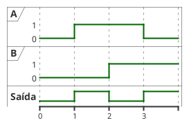
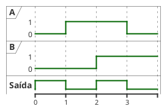

---
icon: pen-to-square  
date: 2025-04-24 13:00:00.00 -3  
category:  
  - aula  
  - exercicio  
  - entrega
order: 5
---  

# Derivação de Expressões Booleanas (Expressões booleana pela Tabela Verdade)

Podemos, ainda, obter expressões booleanas e circuitos lógicos a partir de tabelas verdade. Esse método é fundamental, pois, em muitos casos práticos, o comportamento desejado de um sistema digital é especificado diretamente por uma tabela verdade, que relaciona todas as possíveis combinações de entradas com as saídas correspondentes.

Há basicamente duas maneiras de se definir (ou descrever) uma função Booleana: descrevendo-se todas as situações das variáveis de entrada para as quais a função vale 1 ou, alternativamente, todas as situações em que a função vale 0. O primeiro método é conhecido por soma de produtos (SdP), enquanto que o segundo é chamado produto de somas (PdS). Qualquer função Booleana pode ser descrita por meio de soma de produtos ou por meio de produto de somas. Como as funções Booleanas só podem assumir um dentre dois valores (0 ou 1), basta usar-se um dos dois métodos para se encontrar uma equação para uma função

## Soma de Produtos (SdP)

Dada uma função Booleana de $n$ variáveis (ou seja, $n$ entradas), haverá $2n$ combinações possíveis de valores. Dizemos que esse conjunto de valores que as variáveis podem assumir, juntamente com os respectivos valores da função, constituem o espaço da função. A cada combinação de entradas podemos associar um termo produto, no qual todas as variáveis da função estão presentes, e que é construído da seguinte forma: se a variável correspondente vale 0, ela deve aparecer negada; se a variável vale 1, ela deve aparecer não negada. 

O procedimento consiste em analisar a tabela verdade e identificar todas as linhas em que a saída desejada é igual a 1 (verdadeira). Para cada uma dessas linhas, constrói-se um termo lógico (produto) que representa aquela combinação específica de entradas. Em seguida, todos esses termos são somados (adição lógica, OU) para formar a expressão booleana completa.

1. **Liste todas as combinações de entrada:** Monte a tabela verdade com todas as possíveis combinações das variáveis de entrada.
2. **Identifique as linhas com saída 1:** Observe em quais linhas a saída é igual a 1.
3. **Monte um termo para cada linha:** Para cada linha com saída 1, escreva um termo AND (produto) usando as variáveis de entrada. Se a variável for 1, use-a normalmente; se for 0, use seu complemento (negação).
4. **Some todos os termos:** A expressão booleana final será a soma (OR) de todos os termos obtidos.

Esse método é chamado de **forma canônica de soma de produtos** (SOP, do inglês Sum of Products).

### Exemplo

Considere a seguinte tabela verdade para três variáveis ($A$, $B$, $C$):

| A   | B   | C   | S   |
| --- | --- | --- | --- |
| 0   | 0   | 0   | 0   |
| 0   | 0   | 1   | 1   |
| 0   | 1   | 0   | 1   |
| 0   | 1   | 1   | 0   |
| 1   | 0   | 0   | 1   |
| 1   | 0   | 1   | 0   |
| 1   | 1   | 0   | 0   |
| 1   | 1   | 1   | 1   |

As linhas em que $S = 1$ são:

- (0, 0, 1): $\overline{A} \cdot \overline{B} \cdot C$
- (0, 1, 0): $\overline{A} \cdot B \cdot \overline{C}$
- (1, 0, 0): $A \cdot \overline{B} \cdot \overline{C}$
- (1, 1, 1): $A \cdot B \cdot C$

A expressão booleana será:
$$
S = \overline{A} \cdot \overline{B} \cdot C + \overline{A} \cdot B \cdot \overline{C} + A \cdot \overline{B} \cdot \overline{C} + A \cdot B \cdot C
$$

A fim de simplificar a notação, o símbolo da operação E pode ser omitido. Desta forma, a equação anterior pode ser reescrita de maneira mais concisa

$S = \overline{AB}C + \overline{A}B\overline{C} + A\overline{BC} + ABC$

### Aplicação prática

Na prática, esse é o método mais comum para projetar circuitos lógicos a partir de requisitos funcionais, pois permite partir diretamente do comportamento desejado (tabela verdade) para a implementação física (circuito lógico). Após obter a expressão, pode-se simplificá-la usando as leis da álgebra Booleana, tornando o circuito mais eficiente.


#### Exercício
1. Obtenha a expressão que executa a tabela verdade a seguir e desenhe o circuito lógico

| A   | B   | S   |
| --- | --- | --- |
| 0   | 0   | 0   |
| 0   | 1   | 1   |
| 1   | 0   | 1   |
| 1   | 1   | 0   |


## Produto de Somas (PdS)

O método de **produto de somas** (PdS) é uma alternativa ao soma de produtos para descrever funções booleanas a partir da tabela verdade. Nesse método, a expressão booleana é formada identificando todas as linhas em que a saída desejada é igual a 0 (falsa).

O procedimento consiste em:

1. **Liste todas as combinações de entrada:** Monte a tabela verdade com todas as possíveis combinações das variáveis de entrada.
2. **Identifique as linhas com saída 0:** Observe em quais linhas a saída é igual a 0.
3. **Monte um termo para cada linha:** Para cada linha com saída 0, escreva um termo OR (soma) usando as variáveis de entrada. Se a variável for 0, use-a normalmente; se for 1, use seu complemento (negação).
4. **Multiplique todos os termos:** A expressão booleana final será o produto (AND) de todos os termos obtidos.

Esse método é chamado de **forma canônica de produto de somas** (POS, do inglês Product of Sums).

### Exemplo

Considere a seguinte tabela verdade para três variáveis ($A$, $B$, $C$):

| A   | B   | C   | S   |
| --- | --- | --- | --- |
| 0   | 0   | 0   | 0   |
| 0   | 0   | 1   | 1   |
| 0   | 1   | 0   | 1   |
| 0   | 1   | 1   | 0   |
| 1   | 0   | 0   | 1   |
| 1   | 0   | 1   | 0   |
| 1   | 1   | 0   | 0   |
| 1   | 1   | 1   | 1   |


As linhas em que $S = 0$ são:

- (0, 0, 0): $A + B + C$
- (0, 1, 1): $A + \overline{B} + \overline{C}$
- (1, 0, 1): $\overline{A} + B + \overline{C}$
- (1, 1, 0): $\overline{A} + \overline{B} + C$

A expressão booleana será:
$$
S = (A + B + C) \cdot (A + \overline{B} + \overline{C}) \cdot (\overline{A} + B + \overline{C}) \cdot (\overline{A} + \overline{B} + C)
$$


Note que a ordem de precedência de uma expressão em produto de somas é “primeiro cada soma deve ser avaliada, para só então avaliar-se o produto”. Isto significa que os parêntesis em torno de cada termo soma são obrigatórios! Repare também que os símbolos referentes à operação E (entre os termos soma) podem ser omitido

$S = (A + B + C)(A + \overline{B} + \overline{C})(\overline{A} + B + \overline{C})(\overline{A} + \overline{B} + C)
$

### Aplicação prática

O método PdS é útil em situações onde é mais fácil identificar as condições em que a saída deve ser 0. Assim como no método SdP, a expressão obtida pode ser simplificada usando as leis da álgebra Booleana para otimizar o circuito lógico.


#### Exercício
1. Obtenha a expressão que executa a tabela verdade a seguir e desenhe o circuito lógico

| A   | B   | S   |
| --- | --- | --- |
| 0   | 0   | 1   |
| 0   | 1   | 0   |
| 1   | 0   | 0   |
| 1   | 1   | 1   |


## Ou exclusivo

A porta lógica **OU exclusivo** (XOR, do inglês *exclusive OR*) realiza uma operação lógica especial: sua saída é 1 se, e somente se, o número de entradas em nível lógico 1 for ímpar (no caso de duas entradas, se as entradas forem diferentes). Para duas entradas $A$ e $B$, a saída $S$ é 1 apenas quando $A \neq B$.

O símbolo da porta XOR é semelhante ao da porta OR, mas com uma linha adicional na entrada.

<figure>

```upmath
\ctikzset{logic ports=ieee, logic ports/fill=gray!30}
\begin{circuitikz}
  % Entradas
  \node (A) at (0,2) {A};
  \node (B) at (0,0.88) {B};
  % XOR para A e B
  \node[xor port, scale=2] (xor1) at (3,1.45) {};
  \draw (A.east) -- (xor1.in 1);
  \draw (B.east) -- (xor1.in 2);
  % Saída
  \draw (xor1.out) -- ++(0.7,0) node[right]{$A \oplus B$};
\end{circuitikz}
```

<figcaption>Símbolo da porta lógica XOR (OU exclusivo) com 2 entradas.</figcaption>
</figure>

A tabela verdade da porta XOR para duas entradas é:


|   A   |   B   | $S = A \oplus B$ |
| :---: | :---: | :--------------: |
|   0   |   0   |        0         |
|   0   |   1   |        1         |
|   1   |   0   |        1         |
|   1   |   1   |        0         |

A expressão booleana para a porta XOR de duas entradas é:
$$
S = (A \cdot \overline{B}) + (\overline{A} \cdot B)
$$

A porta XOR é muito utilizada em circuitos de soma, comparadores e sistemas onde é necessário detectar diferenças entre sinais.

<figure>



<figcaption>Funcionamento da porta XOR com o sinal variando com o tempo</figcaption>
</figure>

<figure>

```upmath
\ctikzset{logic ports=ieee, logic ports/fill=gray!30}
\begin{circuitikz}
    \node [and port,scale=2](and1) at (0,0) {};
    \node (labelA) at (-6,0.55) {A};
    \draw (and1.in 2) -- ++(-3.5,0) node[left](labelB){B};
    \draw (labelA.east) -- ++(1,0) to[inline not] ++(2,0) -- (and1.in 1);
    \node [and port,scale=2](and2) at (0,-4) {};
    \draw (labelA.east) ++(0.5,0) node[circ]{} |- (and2.in 1);
    \draw (labelB.east) ++(0.3,0) node[circ]{} -- ++(0,-4)
    to[inline not] ++(2,0) -- (and2.in 2) ;
    \node [or port,scale=2](or1) at (6,-2) {};
    \draw (and1.out) -- (or1.in 1);
    \draw (and2.out) -- (or1.in 2);
\end{circuitikz}
```

<figcaption>Implementação detalhada da porta XOR (OU exclusivo) usando portas AND, OR e NOT.</figcaption>
</figure>

## Não OU exclusivo

A porta lógica **NÃO OU exclusivo** (XNOR, do inglês *exclusive NOR*) realiza a operação inversa da porta XOR. Sua saída é 1 se, e somente se, o número de entradas em nível lógico 1 for par (no caso de duas entradas, se as entradas forem iguais). Para duas entradas $A$ e $B$, a saída $S$ é 1 apenas quando $A = B$.

O símbolo da porta XNOR é semelhante ao da porta XOR, mas com um pequeno círculo na saída, indicando a negação.

<figure>

```upmath
\ctikzset{logic ports=ieee, logic ports/fill=gray!30}
\begin{circuitikz}
  % Entradas
  \node (A) at (0,2) {A};
  \node (B) at (0,0.88) {B};
  % XNOR para A e B
  \node[xnor port, scale=2] (xnor1) at (3,1.45) {};
  \draw (A.east) -- (xnor1.in 1);
  \draw (B.east) -- (xnor1.in 2);
  % Saída
  \draw (xnor1.out) -- ++(0.7,0) node[right]{$A \odot B$};
\end{circuitikz}
```

<figcaption>Símbolo da porta lógica XNOR (NÃO OU exclusivo) com 2 entradas.</figcaption>
</figure>

A tabela verdade da porta XNOR para duas entradas é:

|   A   |   B   | $S = A \odot B$ |
| :---: | :---: | :-------------: |
|   0   |   0   |        1        |
|   0   |   1   |        0        |
|   1   |   0   |        0        |
|   1   |   1   |        1        |

A expressão booleana para a porta XNOR de duas entradas é:
$$
S = (A \cdot B) + (\overline{A} \cdot \overline{B})
$$

A porta XNOR é utilizada em comparadores de igualdade e circuitos onde é necessário detectar se dois sinais são iguais.

<figure>



<figcaption>Funcionamento da porta XNOR com o sinal variando com o tempo</figcaption>
</figure>

<figure>

```upmath
\ctikzset{logic ports=ieee, logic ports/fill=gray!30}
\begin{circuitikz}
    \node [and port,scale=2](and1) at (0,0) {};
    \node (labelA) at (-6,0.55) {A};
    \draw (and1.in 2) -- ++(-3.5,0) node[left](labelB){B};
    \draw (labelA.east) -- ++(1,0) -- (and1.in 1);
    \node [and port,scale=2](and2) at (0,-4) {};
    \draw (labelA.east) ++(0.5,0) node[circ]{} -- ++(0,-4)
    to[inline not] ++(2,0) -- (and2.in 1);
    \draw (labelB.east) ++(0.3,0) node[circ]{} -- ++(0,-4)
    to[inline not] ++(2,0) -- (and2.in 2) ;
    \node [or port,scale=2](or1) at (6,-2) {};
    \draw (and1.out) -- (or1.in 1);
    \draw (and2.out) -- (or1.in 2);
\end{circuitikz}
```

<figcaption>Implementação detalhada da porta XNOR (NÃO OU exclusivo) usando portas AND, OR e NOT.</figcaption>
</figure>


## Leis Fundamentais e Propriedades da Álgebra Booleana 

A álgebra Booleana é regida por um conjunto de leis e propriedades que definem o comportamento das variáveis e operações lógicas. Essas leis são fundamentais para simplificar expressões e projetar circuitos eficientes.

Sejam $A$ e $B$ duas variáveis Booleanas. O espaço Booleano é definido por:

::: info
se $A \neq 0$, então $A = 1$

se $A \neq 1$, então $A = 0$
:::

As operações elementares são: **OU** (adição lógica), **E** (multiplicação lógica) e **complementação** (negação). As principais propriedades são:

- **Adição lógica (OU):**  
  $$
  \begin{align}
  A + 0 = A \\
  A + 1 = 1 \\
  A + A = A \\
  A + \overline{A} = 1
  \end{align}
  $$

- **Multiplicação lógica (E):**  
  $$
  \begin{align}
  A \cdot 0 = 0 \\
  A \cdot 1 = A \\
  A \cdot A = A \\
  A \cdot \overline{A} = 0
  \end{align}
  $$

- **Complementação:**  
  $$
  \begin{align}
  \overline{\overline{A}} = A
  \end{align}
  $$

- **Comutatividade:**  
  $$
  \begin{align}
  A + B = B + A \\
  A \cdot B = B \cdot A
  \end{align}
  $$

- **Associatividade:**  
  $$
  \begin{align}
  A + (B + C) = (A + B) + C = (A + C) + B \\
  A \cdot (B \cdot C) = (A \cdot B) \cdot C = (A \cdot C) \cdot B
  \end{align}
  $$

- **Distributiva:**  
  $$
  \begin{align}
  A \cdot (B + C) = A \cdot B + A \cdot C
  \end{align}
  $$

Essas leis permitem manipular e simplificar expressões Booleanas, facilitando o projeto de circuitos lógicos mais simples e eficientes.


### Simplificação da expressão

Aplicando as propriedades de **associatividade** e **distributiva** da álgebra Booleana, é possível simplificar a equação acima. Por exemplo, ao agrupar e reorganizar os termos, podemos identificar fatores comuns e reduzir a expressão, tornando-a mais eficiente para implementação em circuitos lógicos. O uso dessas propriedades é fundamental para minimizar o número de portas lógicas necessárias e otimizar o projeto.


Vamos simplificar a expressão:
$$
S = \overline{A} \cdot \overline{B} \cdot C + \overline{A} \cdot B \cdot \overline{C} + A \cdot \overline{B} \cdot \overline{C} + A \cdot B \cdot C
$$

Agrupando termos semelhantes e aplicando as propriedades da álgebra Booleana, temos:

1. Observe que os termos podem ser agrupados em pares que diferem apenas por uma variável negada:
    - $\overline{A} \cdot \overline{B} \cdot C$ e $A \cdot B \cdot C$ (ambos têm $C$)
    - $\overline{A} \cdot B \cdot \overline{C}$ e $A \cdot \overline{B} \cdot \overline{C}$ (ambos têm $\overline{C}$)

2. Fatorando $C$ e $\overline{C}$:
    $$
    S = C \cdot (\overline{A} \cdot \overline{B} + A \cdot B) + \overline{C} \cdot (\overline{A} \cdot B + A \cdot \overline{B})
    $$

3. Note que:
    - $\overline{A} \cdot \overline{B} + A \cdot B = (A \odot B)$ (XNOR)
    - $\overline{A} \cdot B + A \cdot \overline{B} = (A \oplus B)$ (XOR)

4. Portanto, a expressão simplificada é:
    $$
    S = (A \odot B) \cdot C + (A \oplus B) \cdot \overline{C}
    $$

Ou seja, a saída $S$ é igual a XNOR de $A$ e $B$ quando $C=1$, ou XOR de $A$ e $B$ quando $C=0$.

