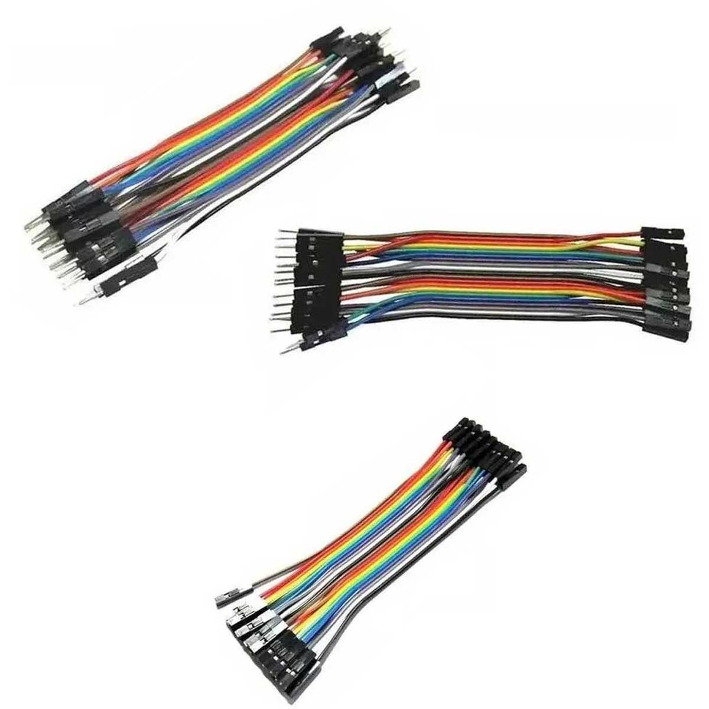
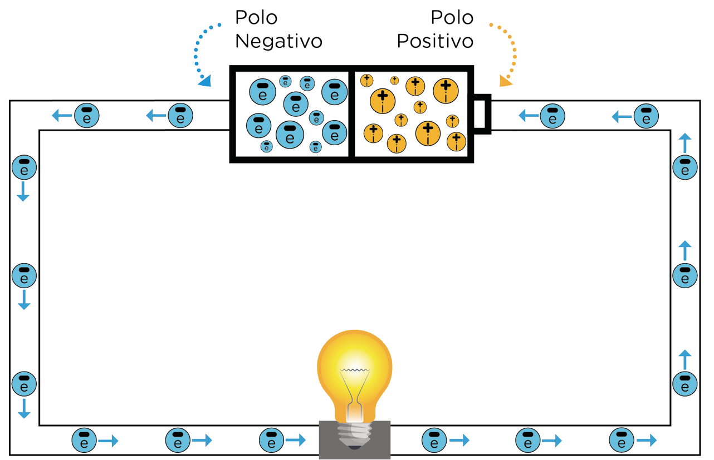
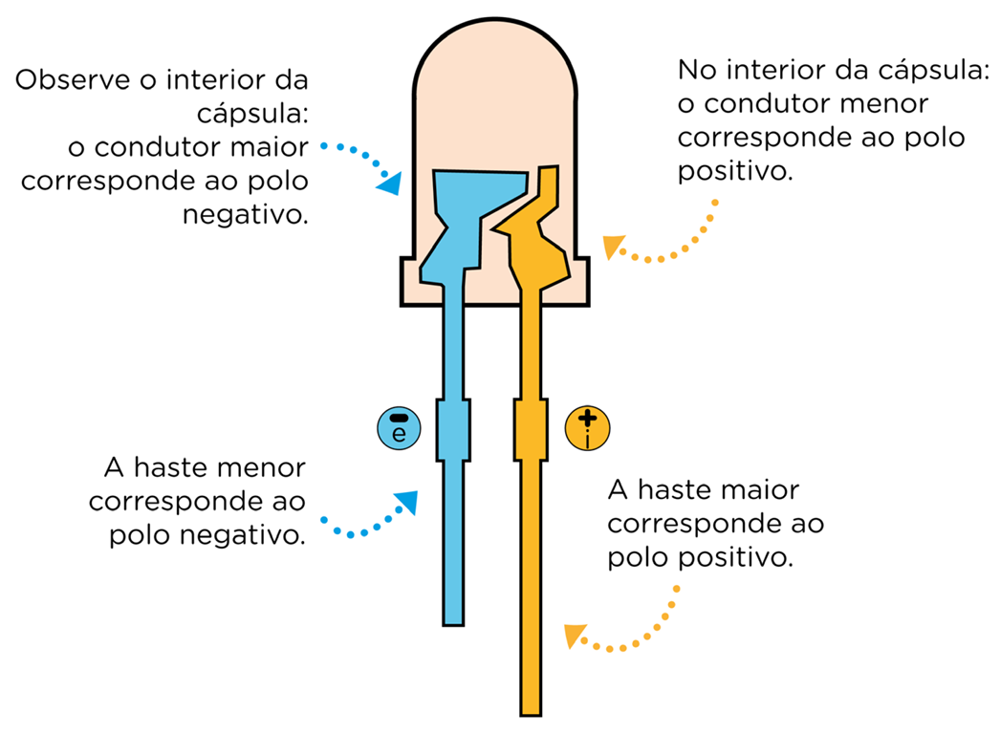
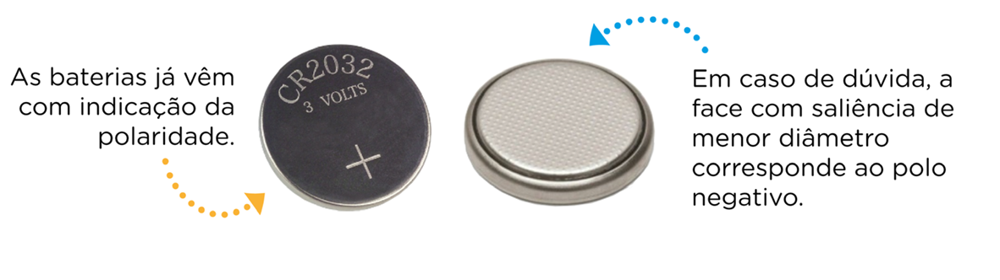
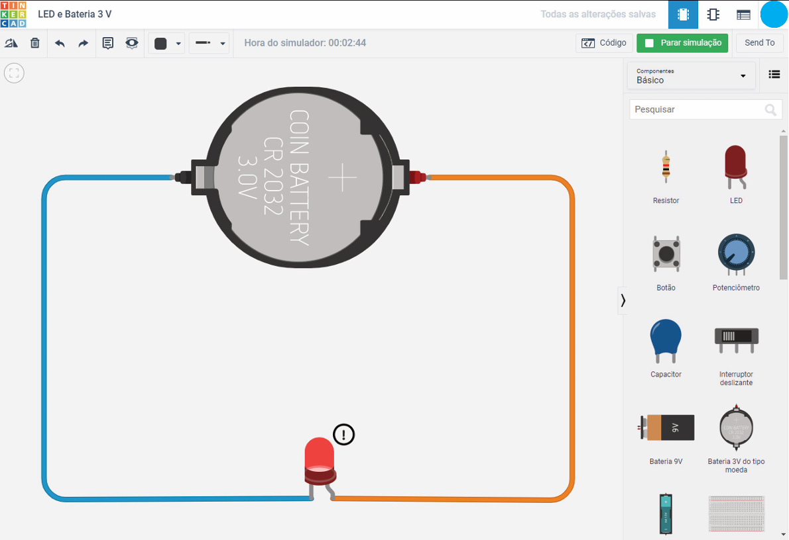
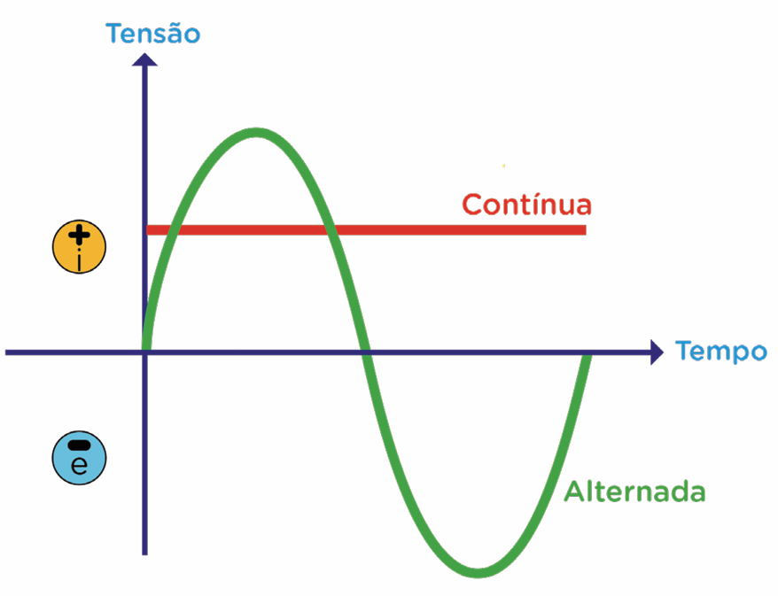
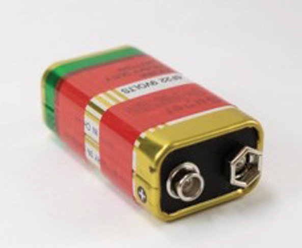
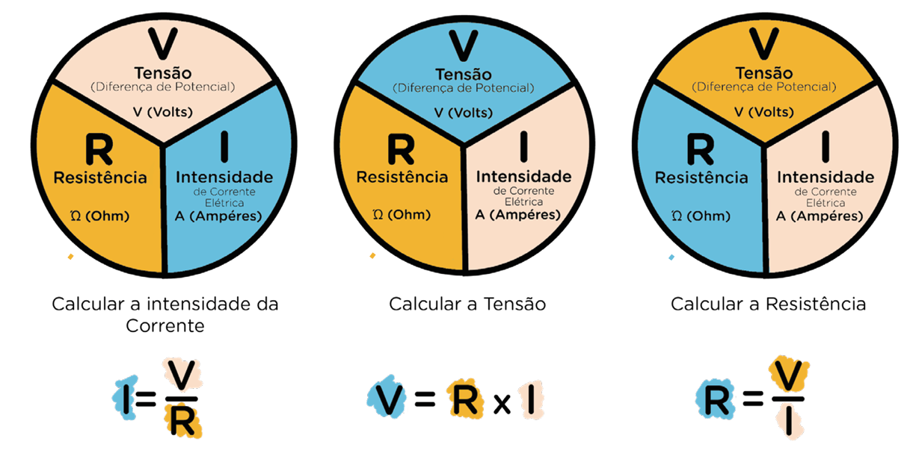

# Tensão, Corrente e Resistência

[^RE_M1]

## Introdução

O estudo da robótica e o desenvolvimento de projetos exigem que saibamos como os componentes eletrônicos e os artefatos elétricos funcionam. Por isso, é extremamente importante compreendermos alguns conceitos básicos da Física, tais como tensão, corrente e resistência. Nesta aula, iremos revisar cada uma dessas grandezas. Vamos lá?

Ao elaborarmos projetos em robótica, é importante saber sobre a tensão a ser aplicada no circuito, bem como qual corrente elétrica deverá passar por este circuito. Do contrário, poderá ocorrer uma sobrecarga no circuito elétrico, danificando os componentes utilizados.

> **Eletrônica é o controle de movimento dos elétrons, controle da corrente elétrica**
>
> **Circuito = Fonte + Condutores + Carga**

Vamos iniciar compreendendo o que é uma corrente elétrica?

A corrente elétrica corresponde ao fluxo ordenado das partículas que possuem carga elétrica (elétrons ou íons) no interior de materiais diversos. Na figura abaixo, visualizamos a representação de um átomo. Em seu núcleo, há os prótons com cargas positivas e nêutrons com carga neutra; ao redor, na eletrosfera, os elétrons com carga negativa.

<figure>

```upmath
\begin{tikzpicture}

% Estilos
\tikzstyle{proton}=[circle, draw=black, fill=red!70, minimum size=6mm, inner sep=0pt]
\tikzstyle{neutron}=[circle, draw=black, fill=green!70, minimum size=6mm, inner sep=0pt]
\tikzstyle{electron}=[circle, draw=black, fill=yellow!80, minimum size=6mm, inner sep=0pt]

% Núcleo (prótons e nêutrons)
\node[proton] (p1) at (0,0) {+};
\node[proton] (p2) at (0.6,0.2) {+};
\node[proton] (p3) at (0.6,-0.39) {+};
\node[neutron] (n1) at (-0.49,0.4) {};
\node[neutron] (n2) at (-0.5,-0.4) {};
\node[neutron] (n3) at (0,-0.7) {};

% Órbitas elípticas
\draw[thick, rotate around={40:(0,0)}] (0,0) ellipse (3.2 and 1.2);
\draw[thick, rotate around={-40:(0,0)}] (0,0) ellipse (4.2 and 1.2);
\draw[thick] (0,0) ellipse (3.8 and 1.2);

% Contorno do núcleo
\draw[thick] (0,0) circle (1); 

% Elétrons nas órbitas
\node[electron] at (1.6,2.3) {-};
\node[electron] at (-1.3,1.2) {-};
\node[electron] at (1,-2.2) {-};

% Rótulos
\node at (0,3.2) {\textbf{ÁTOMO}};
\node (proton) at (7,0) {\textbf{PRÓTON}};
\node (neutron) at (-7,0) {\textbf{NÊUTRON}};
\node at (1.5,-2.8) {\textbf{ELÉTRON}};
\node at (0,1.1) {\textbf{\tiny NÚCLEO}};

% Setas ligando rótulos ao núcleo
\draw[-stealth] (neutron) -- (n1);
\draw[-stealth] (proton) -- (p2);

\end{tikzpicture}
```

<figcaption>Representação de um átomo</figcaption>
</figure>

Os elétrons, nas coisas, estão em movimento, porém de modo aleatório ou desordenado, conforme ilustrado na figura abaixo.

<figure>

```upmath
\begin{tikzpicture}

% Tubo (condutor)
\draw[line width=2pt, rounded corners=10pt] 
  (0,1) -- (12,1) -- (12,-1) -- (0,-1) -- cycle;

% Macro para facilitar criação dos elétrons com setas
\newcommand{\eletron}[4]{
    \node [fill=blue!30, circle, draw] at (#1,#2)  {\textbf{e}}  edge[->, line width=1.5pt] (#3,#4);
}

% Vários elétrons com direções variadas
\eletron{1.2}{0.6}{0.5}{1}
\eletron{1.7}{-0.3}{2.5}{-0.8}
\eletron{2.8}{0.2}{2.1}{-0.1}
\eletron{3.5}{-0.6}{4.2}{-0.2}
\eletron{4.4}{0.5}{5.1}{1}
\eletron{5.3}{-0.4}{4.7}{-1.0}
\eletron{6.0}{0.3}{6.8}{-0.2}
\eletron{7.1}{-0.6}{6.4}{-0.9}
\eletron{7.8}{0.6}{8.5}{0.9}
\eletron{8.6}{-0.2}{9.3}{-0.7}
\eletron{9.5}{0.4}{10.2}{0.1}
\eletron{10.3}{-0.6}{10.9}{-0.3}


\end{tikzpicture}
```

<figcaption>Movimento desordenado de elétrons livres</figcaption>
</figure>

A corrente elétrica é gerada quando os elétrons se movimentam de modo ordenado, seguindo o mesmo fluxo, devido a uma diferença de potencial elétrico aplicada sobre eles. Tal fenômeno é o que faz artefatos, aparelhos e dispositivos eletrônicos funcionarem.

Os elétrons precisam de um meio material condutor para se movimentarem, o qual possibilita também, ao ser conectado a uma fonte de tensão, como a bateria representada na figura abaixo, o fluxo ordenado da carga negativa.
<figure>

```upmath
\begin{tikzpicture}


\draw[line width=2pt, fill=blue!30] 
  (2,2) -- (6,2) -- (6,4) -- (2,4) -- cycle;

\draw[line width=2pt, fill=orange!70] 
  (6,4) -- (10,4) -- (10,2) -- (6,2) -- cycle;
\draw[line width=2pt, fill=orange!70] 
  (10,3.5) -- (10.5,3.5) -- (10.5,2.5) -- (10,2.5) -- cycle;

\draw[line width=2pt] 
  (10.5,3) -- (13,3) -- (13,0) -- (12,0);

\draw[line width=2pt] 
  (2,3) -- (-1,3) -- (-1,0) -- (0,0);


% Tubo (condutor)
\draw[line width=2pt, rounded corners=10pt] 
  (0,1) -- (12,1) -- (12,-1) -- (0,-1) -- cycle;

% Macro para facilitar criação dos elétrons com setas
\newcommand{\eletron}[4]{
    \node [fill=blue!30, circle, draw] at (#1,#2)  {\textbf{e}}  edge[->, line width=1.5pt] (#3,#4);
}

% Vários elétrons com direções variadas
\eletron{1}{0.5}{1.8}{0.5}
\eletron{1}{-0.5}{1.8}{-0.5}
\eletron{2.3}{0.5}{3.1}{0.5}
\eletron{2.3}{-0.5}{3.1}{-0.5}
\eletron{3.6}{0.5}{4.4}{0.5}
\eletron{3.6}{-0.5}{4.4}{-0.5}
\eletron{4.9}{0.5}{5.7}{0.5}
\eletron{4.9}{-0.5}{5.7}{-0.5}
\eletron{6.2}{0.5}{7.0}{0.5}
\eletron{6.2}{-0.5}{7.0}{-0.5}
\eletron{7.5}{0.5}{8.3}{0.5}
\eletron{7.5}{-0.5}{8.3}{-0.5}
\eletron{8.8}{0.5}{9.6}{0.5}
\eletron{8.8}{-0.5}{9.6}{-0.5}
\eletron{10.1}{0.5}{10.9}{0.5}
\eletron{10.1}{-0.5}{10.9}{-0.5}


\end{tikzpicture}
```
<figcaption>Movimento ordenado de elétrons em um condutor conectado a uma fonte de tensão</figcaption>
</figure>


Materiais como alumínio, ouro, potássio, mercúrio e gases ionizados são condutores, e, na eletrônica, um exemplo clássico de condutor, muito utilizado em projetos e com baixa resistência elétrica, é o fio (ou cabo) de cobre.

  

Imagine que você está correndo ao redor da escola. Ao correr alguns metros, há elementos que podem se colocar "contra" o seu movimento: a direção do vento, a aderência de seu tênis ao solo, o conforto térmico, o controle da respiração, dentre outros. No caso da eletricidade, quando um elétron se movimenta, ele sofre uma força contrária em seu caminho, que é a resistência elétrica (veremos, na sequência, um pouco mais sobre o tema). Isto está relacionado, por exemplo, à espessura do fio ou cabo utilizado (sua dimensão poderá definir maior ou menor resistência elétrica) ou mesmo ao material que estiver em contato com a corrente elétrica, como a cerâmica ou o plástico, que são materiais isolantes e dificultam a movimentação dos elétrons.

> **A tensão é a força que coloca os elétrons em movimento, ou seja, a força que cria a corrente elétrica.**

Como vimos, nos condutores a corrente elétrica é gerada pela movimentação ordenada dos elétrons. Por possuírem cargas de sinal negativo, tendem a seguir em direção ao maior potencial, que é o polo positivo. Esse é o sentido real da corrente elétrica - fluxo de elétrons do polo negativo para o polo positivo.

Na análise de circuitos elétricos, adota-se o sentido convencional, em que se atribui à carga dos elétrons o sinal positivo, o que resulta no movimento dos elétrons ao menor potencial, que é o polo negativo - fluxo de elétrons do polo positivo para o polo negativo.

A figura abaixo representa cada sentido ao ilustrar o processo de acendimento de uma lâmpada incandescente a partir de uma bateria.

  

Que tal verificar, de modo prático, o funcionamento de um circuito e compreender o sentido da corrente quando ligamos um LED a uma bateria, tal como ilustrado na figura 5?

Para isso, observe a bateria 3V e o LED, veja que ambos possuem lados distintos, os quais correspondem aos polos positivo e negativo, conforme ilustrado a seguir:

  

  

Localizadas as polaridades, chegou o momento de conectar o LED à bateria, respeitando as polaridades no momento do encaixe.

Para esta atividade de funcionamento de um circuito, você pode utilizar também o simulador online Tinkercad.

Ao entrar no Tinkercad utilizando [sua conta](https://www.tinkercad.com/joinclass/5F7QFGMPQ), localize no item “Componentes Básicos” o LED e a bateria 3V, arrastando-os até a área central de prototipagem. Então, clique sobre um dos pinos do LED, identificando sua polaridade, e siga com o cursor até a polaridade correspondente da bateria 3V. Repita o mesmo processo com a polaridade contrária, fechando o circuito, e clique no botão “Iniciar simulação”.

  
*Fonte: Tinkercad*

Nos experimentos acima, você verificou a polaridade e o sentido da corrente. Além disso, a corrente elétrica pode ter dois tipos de fluxo: fluxo ordenado ou com variações, o que caracteriza, respectivamente, as correntes Contínua (CC) e Alternada (CA), conforme o infográfico a seguir:



## Corrente Contínua e Corrente Alternada


**Corrente Contínua**

O fluxo ordenado dos elétrons ocorre em apenas uma direção (positiva ou negativa), sem variação.

A corrente contínua é a mais comum em circuitos eletrônicos, como os utilizados em computadores, celulares e outros dispositivos. A bateria de 9V, fonte de celular, pilhas e placas solares são exemplos de fontes de corrente contínua.

**Corrente Alternada**

Fluxo dos elétrons com variação no decorrer do tempo e  alternância entre tensão positiva e tensão negativa. 

A quantidade de ciclos, em um determinado intervalo de tempo, é chamada de frequência. No caso de uma frequência de 60Hz, tem-se 60 ciclos por segundo.

A corrente alternada é a mais comum em circuitos elétricos, como os utilizados em residências e indústrias. A energia elétrica que chega às casas e empresas é um exemplo de corrente alternada, pois a tensão elétrica varia entre valores positivos e negativos.

Tensões de 120V, 127V, 220V e 240V são exemplos de tensões alternadas, que variam entre -170V e +170V. A corrente alternada é utilizada em eletrodomésticos, como geladeiras, micro-ondas e ar-condicionado.


**A Batalha das Correntes | Trailer Oficial (2min49)**

De grande relevância histórica e variados aspectos técnicos, o filme [“A Batalha das Correntes](https://www.youtube.com/watch?v=tuqp1D8N7Hg)” (“The Current War”, EUA, 2017), dirigido por Alfonso Gomez-Rejon, apresenta a disputa, ocorrida no final do século XIX, entre Thomas Edison (Benedict Cumberbatch), que já havia lançado a lâmpada incandescente, e George Westinghouse (Michael Shannon) e Nikola Tesla (Nicholas Hoult) acerca do sistema de distribuição de energia elétrica nos Estados Unidos. Enquanto Edison defendia a utilização da corrente contínua, Westinghouse e Tesla defenderam a corrente alternada.

**[Tesla vs. Edison: A Disputada Guerra das Correntes | Artigo](https://aventurasnahistoria.com.br/noticias/reportagem/historia-tesla-vs-edison-a-guerra-das-correntes.phtml)**


### Tensão Elétrica

A tensão elétrica é a grandeza física que representa a diferença de potencial elétrico entre dois pontos de um circuito, determinando a quantidade de energia a ser fornecida ao circuito, permitindo, assim, o funcionamento de um equipamento ou artefato elétrico.

> **força - funcionamento**

Como um primeiro exemplo de artefato elétrico, podemos pensar na lâmpada incandescente, pois a diferença de potencial elétrico nas extremidades de seu filamento determinará sua luminosidade (atualmente, é mais comum o uso de lâmpadas de LED por conta de sua eficiência energética para iluminação, pois a lâmpada incandescente gera mais calor que luz). Outro exemplo que temos são os fornos elétricos, pois os filamentos que assarão as comidas são aquecidos pela transição de elétrons em barras de metal que apresentam resistência a eles - e a resistência, como veremos mais à frente, gera calor!


### Treine Mais!

Que tal um exercício “prático” de calor gerado pela resistência?

Esfregue a sua mão, uma contra a outra, e perceba que ela gera calor. Agora, pense que uma de suas mãos é o elétron e a outra o metal por onde ele percorre o caminho. Com o atrito de ambos, é gerado calor e, algumas vezes, luz também!

Por isso, vários componentes eletrônicos, para terem um funcionamento otimizado, necessitam de algo que os resfrie, como, no caso de computadores e micro-ondas, aberturas na parte lateral e/ou traseira.

No caso de baterias, uma das fontes de tensão que nos acompanhará ao longo de nossos projetos, a diferença de potencial elétrico entre os polos determinará sua força elétrica. O tempo de duração da bateria dependerá da quantidade de carga presente nela.

  

De acordo com o Sistema Internacional de Unidades, a unidade de medida volt (V) é a unidade da tensão elétrica ou da diferença de potencial elétrico (ddp) que representa o potencial de transmissão de energia. No caso de uma bateria de 9V, um dos itens que pode compor variados projetos de robótica, por exemplo, a diferença de potencial elétrico entre seus polos positivo e negativo é de 9V, o que convencionou, então, a referência à bateria como “bateria 9V”.

A diferença de potencial é importante porque a corrente elétrica só se dará nos momentos em que houver diferença de potencial elétrico.

Na montagem de projetos em robótica, a regulagem da tensão e da corrente aplicada, por exemplo, na montagem do circuito de um robô, são importantes. Caso não haja um controle ou aplicação correta da corrente elétrica no projeto, poderão ocorrer danos nos componentes utilizados.

### Resistência Elétrica

Resistência elétrica é uma grandeza que indica o quanto um determinado condutor se opõe à passagem da corrente elétrica, dificultando o fluxo de elétrons.

Os componentes presentes em um artefato eletrônico, tais como Resistores, Capacitores e Fusíveis, compõem o circuito elétrico pelo qual a corrente elétrica passará e em todo este caminho haverá uma resistência. Com o movimento de elétrons livres no condutor, conforme suas características, pode haver uma maior colisão entre estes elétrons, o que acarretaria em uma limitação da quantidade de elétrons presentes na corrente elétrica.


### Leis de Ohm

A eletricidade lida com variadas grandezas e equações. Dentre as equações, destacamos a Primeira Lei de Ohm, formulada pelo físico e matemático Georg Simon Ohm (1789 – 1854) a partir de experimentos com a variação de tensão em um circuito e a percepção, em cálculos, de que há uma proporcionalidade entre a diferença de potencial e a corrente elétrica, além de uma razão constante entre as três principais grandezas: corrente elétrica (cuja unidade é Ampère - A), tensão elétrica ou diferença de potencial elétrico (cuja unidade é Volt - V) e resistência elétrica (cuja unidade é Ohm - Ω). Partindo da Primeira Lei de Ohm, é possível calcular a tensão e a corrente presente em qualquer ponto de circuitos eletrônicos.

Mas afinal, o que nos informa esta Lei de Ohm?

Na Primeira Lei de Ohm temos que a resistência elétrica em um condutor é equivalente à razão da diferença de potencial entre seus terminais pela corrente que flui pelo condutor. Assim, é possível determinar qual corrente perpassará um circuito com a aplicação de determinada tensão entre seus terminais, estabelecendo, assim, as especificações de um projeto.

Por se tratar de uma razão constante entre as grandezas, a Primeira Lei de Ohm pode ser calculada através das seguintes equações:




Onde:

- **V** = Tensão elétrica ou ddp (V)
- **R** = Resistência elétrica (Ω)
- **I** = Intensidade da corrente elétrica (A)


### Treine Mais!

A plataforma de prototipagem Tinkercad possui um espaço de aprendizagem. Na lição [Ohm’s Law](https://www.tinkercad.com/learn/overview/OOUF6LFL20FZS45?type=circuits), tutorial composto por cinco etapas e disponível em inglês, você poderá aprender sobre um conceito fundamental em design de circuito, a Lei de Ohm, e o aplicará para garantir o acendimento de um LED com segurança.


  

*Fonte: Tinkercad*


Como a eletricidade se trata do movimento de elétrons, a eletrônica, também aliada à robótica, tem a ver com isso, com o que a gente usa para controlar este movimento dos elétrons: se irão para um lado ou para o outro, se serão transformados em luz, som, calor etc.

[Tente agora com uma bateria 9V](https://www.tinkercad.com/joinclass/5F7QFGMPQ)


## Referências

 [^RE_M1]: ESCOLA DIGITAL PR. Material didático. Disponível em: https://aluno.escoladigital.pr.gov.br/re-m1. Acesso em: 08 maio 2025.
