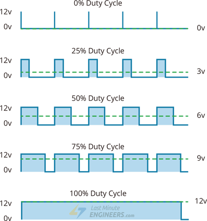
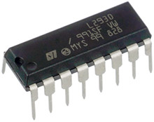
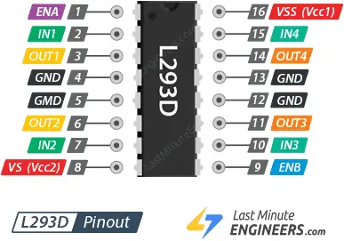
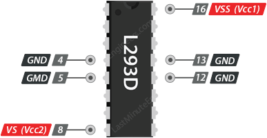
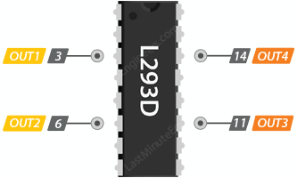
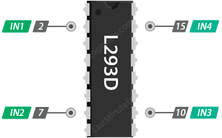
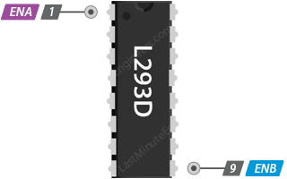

# IC L293D e PWM

[^1]

## Compreendendo os princípios básicos do controle motor

Antes de aprender sobre o driver do motor L293D, é importante entender dois conceitos principais:

- Circuito H-Bridge – permite controlar o sentido de rotação do motor
- PWM (modulação por largura de pulso) – ajuda a controlar a velocidade de um motor DC

## Controlando a velocidade com PWM (modulação por largura de pulso)

Quando uma tensão fixa é aplicada a um motor CC, ele gira a uma velocidade fixa. Se você quiser alterar a velocidade, precisará ajustar a tensão. Uma tensão mais alta faz o motor girar mais rápido, enquanto uma tensão mais baixa o torna mais lento.

No entanto, alterar fisicamente a voltagem o tempo todo não é muito prático. É aí que entra a PWM, ou Modulação por Largura de Pulso.

PWM é uma maneira inteligente de controlar a quantidade média de potência enviada ao motor. Em vez de enviar uma tensão fixa, o PWM liga e desliga a tensão rapidamente em pulsos muito rápidos.

A “largura” de cada pulso ON, também chamado de ciclo de trabalho, determina por quanto tempo a tensão fica “ON” durante cada ciclo.

- Se a tensão estiver LIGADA na maior parte do tempo (um pulso mais amplo), o motor recebe uma tensão média mais alta e gira mais rápido.
- Se a tensão estiver desligada na maior parte do tempo (um pulso mais estreito), o motor receberá uma tensão média mais baixa e girará mais devagar.

A imagem abaixo mostra como diferentes ciclos de trabalho produzem diferentes tensões médias, que por sua vez afetam a velocidade do motor.

## CI driver de motor L293D

O L293D é um circuito integrado (CI) muito popular e amplamente utilizado, projetado principalmente para acionar cargas indutivas, como motores CC, motores de passo, relés e solenoides. Ele funciona como um amplificador de corrente, ou seja, recebe os sinais de controle de baixa corrente de um microcontrolador (como um Arduino) e os eleva para os níveis de corrente e tensão mais altos necessários para o funcionamento dos motores.
Circuito integrado L293D

## Potência do L293D

O L293D é bastante flexível em termos de potência. Ele pode operar com uma ampla faixa de tensões, de 4,5 V a 36 V, o que significa que é compatível com diversos tipos de motores.

Além disso, o L293D também é capaz de lidar com uma quantidade razoável de corrente. Cada canal do L293D pode fornecer até 600 miliamperes (mA) de corrente contínua e suportar picos curtos de até 1,2 amperes (A) por canal. Embora esses números possam parecer pequenos, eles são perfeitos para a maioria dos motores pequenos que amadores e estudantes costumam usar em seus projetos.

## Pinagem do CI do driver do motor L293D

O L293D tem 16 pinos no total.
Pinagem do CI do driver do motor de ponte H dupla L293D

Vamos analisar cada grupo de pinos para entender o que eles fazem e como funcionam.

### Pinos de energia

O L293D requer duas fontes de energia separadas:

`VSS (VCC1)`alimenta o circuito lógico interno do CI. Você conectará este pino a uma fonte de alimentação de 5 V.

`VS (VCC2)`fornece energia aos motores. Você pode conectar qualquer tensão entre 4,5 V e 36 V, dependendo do motor utilizado.

`GND`Os pinos são as conexões de aterramento comuns. O CI possui quatro pinos de aterramento, todos conectados internamente. Esses pinos têm duas funções importantes: fornecem um ponto de referência comum para todas as tensões no circuito e, igualmente importante, auxiliam na dissipação de calor.

::: info 

Motores são cargas indutivas e podem consumir correntes significativas, especialmente durante a partida, mudanças de direção ou sob carga pesada. Esse alto fluxo de corrente através dos transistores de ponte H internos gera calor. Esses múltiplos pinos de aterramento atuam como condutores térmicos, permitindo que o calor gerado dentro do CI seja conduzido para os trilhos de cobre na Placa de Circuito Impresso (PCB) à qual estão soldados. Ao conectar esses pinos a um grande vazamento de cobre ou plano de aterramento na PCB, a própria PCB atua como um dissipador de calor, ajudando a evitar que o CI superaqueça e entre em seu estado de desligamento térmico.

:::

### Pinos de saída do motor

Esses são os pinos onde você realmente conecta seus motores CC.

Os pinos `OUT1` e `OUT2` conectam-se ao seu primeiro motor (motor A), enquanto os pinos `OUT3` e `OUT4` conectam-se ao seu segundo motor (motor B). Você pode conectar qualquer motor CC que funcione com 5 a 36 volts a esses pinos.

### Pinos de controle de direção

Esses pinos controlam a direção de rotação dos motores ligando e desligando os interruptores internos da ponte H:

O chip possui dois pinos de controle de direção para cada motor. Os pinos`IN1` e `IN2` controlam a direção de rotação do motor A, enquanto os pinos `IN3` e `IN4` controlam a direção de rotação do motor B.

Ao definir diferentes combinações de sinais ALTO ou BAIXO nesses pinos, você pode fazer os motores girarem para frente, para trás ou parar. A table abaixo mostra exatamente como isso funciona:

|IN1 	|IN2 |	Direção de rotação|
|---	|---	|---	|
|Baixo(0) |	Baixo(0) |	Motor desligado|
|Alto(1) |	Baixo(0) |	Avançar|
|Baixo(0) |	Alto(1) |	Para trás|
|Alto(1) |	Alto(1)| 	Motor desligado|

: Demonstração de controle de direção do motor L293D

### Pinos de controle de velocidade

Os pinos `ENA`e  `ENB` controlam a velocidade com que seus motores giram.

Na verdade, esses pinos funcionam como simples interruptores liga/desliga. Ao puxar um deles para a posição ALTA, o motor correspondente é ativado e gira em velocidade máxima com base nas suas entradas de direção. Ao puxá-lo para a posição BAIXA, o motor é completamente desativado e não gira.

Mas esses pinos podem fazer mais do que apenas ligar ou desligar os motores. Ao enviar um sinal PWM (Modulação por Largura de Pulso) para ENA ou ENB, você pode controlar a velocidade de cada motor.

Com o PWM, você habilita e desabilita o motor rapidamente, várias vezes por segundo. A chave é o ciclo de trabalho, ou seja, quanto tempo o sinal permanece LIGADO em cada ciclo. Um tempo LIGADO mais longo significa que o motor fica ativo por mais tempo do ciclo, então ele gira mais rápido. Um tempo LIGADO mais curto significa que ele fica habilitado por menos tempo por ciclo, então ele gira mais lentamente.

## Referências

[^1]: https://lastminuteengineers.com/l293d-dc-motor-arduino-tutorial/

[^2]: https://lastminuteengineers-com.translate.goog/l293d-dc-motor-arduino-tutorial/?_x_tr_sl=en&_x_tr_tl=pt&_x_tr_hl=pt&_x_tr_pto=tc

