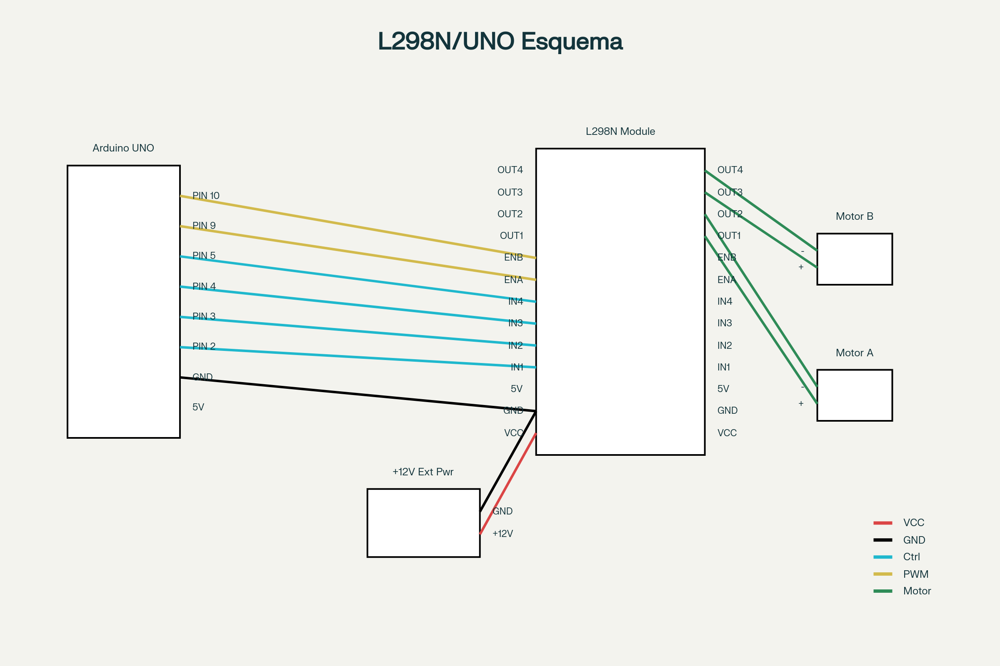

# Ponte H para Controle de Motores com Arduino

## Introdução
A ponte H é um circuito eletrônico que permite controlar a direção e velocidade de motores DC, sendo amplamente utilizada em robótica e automação[^1][^2][^3]. Este guia tem como objetivo fornecer uma compreensão detalhada do funcionamento da ponte H, suas aplicações práticas com Arduino e as melhores práticas para garantir a segurança dos circuitos.

## Módulo L298N: Especificações e Características

O módulo ponte H L298N é amplamente utilizado em projetos de robótica educacional devido à sua robustez e facilidade de uso[^5][^6][^7]. Este módulo incorpora o circuito integrado L298N da STMicroelectronics, que contém duas pontes H completas, permitindo o controle independente de dois motores DC ou um motor de passo bipolar[^5][^8][^6].




### Especificações Técnicas

| Parâmetro                | Valor                  |
| :----------------------- | :--------------------- |
| Tensão de operação       | 6V a 35V[^5][^8]       |
| Corrente máxima contínua | 2A por canal[^5][^8]   |
| Corrente máxima total    | 4A[^5][^8]             |
| Tensão lógica            | 5V[^5][^8]             |
| Corrente lógica          | 0-36mA[^5][^8]         |
| Potência máxima          | 25W[^5][^8]            |
| Faixa de temperatura     | -20°C a +135°C[^5][^8] |
| Dimensões                | 43×43×27mm[^5][^8]     |
| Peso                     | 30g[^5][^8]            |

### Pinagem e Conexões

**Alimentação:**

- **VCC (6-35V)**: Entrada da fonte externa para alimentação dos motores[^5][^9]
- **GND**: Terra comum (deve ser conectado ao GND do Arduino)[^5][^9]
- **5V**: Saída do regulador interno quando jumper está presente[^5][^9]

**Controle dos Motores:**

- **IN1, IN2**: Controle de direção do Motor A[^5][^9]
- **IN3, IN4**: Controle de direção do Motor B[^5][^9]
- **ENA**: Controle de velocidade do Motor A (PWM)[^5][^9]
- **ENB**: Controle de velocidade do Motor B (PWM)[^5][^9]

**Saídas para Motores:**

- **OUT1, OUT2**: Terminais do Motor A[^5][^9]
- **OUT3, OUT4**: Terminais do Motor B[^5][^9]


## Controle de Velocidade com PWM

A modulação por largura de pulso (PWM) é a técnica utilizada para controlar a velocidade dos motores DC de forma eficiente[^10][^11][^12]. O PWM mantém a amplitude da tensão constante (5V do Arduino) e varia a largura dos pulsos, alterando assim a tensão média aplicada ao motor[^10][^13][^11].

### Vantagens do Controle PWM

**Eficiência energética**: O PWM trabalha com eficiência próxima a 100%, enquanto métodos resistivos desperdiçam até 50% da energia em aquecimento[^10][^13].

**Manutenção do torque**: Os pulsos PWM mantêm a tensão nominal de pico, gerando maior torque nos motores mesmo em baixas velocidades[^10][^13][^14].

**Redução de aquecimento**: Componentes de chaveamento dissipam menos calor comparado aos métodos lineares[^10][^13][^14].

### Implementação no Arduino

O Arduino possui 6 pinos PWM (3, 5, 6, 9, 10 e 11) que podem ser utilizados para controle de velocidade[^15][^16]. O comando `analogWrite(pino, valor)` gera um sinal PWM onde o valor varia de 0 (0V médio) a 255 (5V médio)[^17][^15][^16].

```cpp
// Exemplo de controle de velocidade
analogWrite(ENA, 128); // 50% da velocidade máxima
analogWrite(ENA, 255); // Velocidade máxima
analogWrite(ENA, 0);   // Motor parado
```


## Cuidados com a Fonte de Alimentação

A proteção do Arduino contra danos causados por problemas na alimentação é crucial para o sucesso dos projetos de robótica[^18][^19][^20]. Motores DC consomem correntes muito superiores às que os pinos do Arduino podem fornecer, tornando essencial o uso de uma fonte externa adequada[^18][^19][^21].

### Problemas Comuns e Soluções

- **Sobrecarga do Arduino**: Os pinos digitais do Arduino fornecem no máximo 40mA, enquanto motores podem exigir 500mA ou mais[^18][^19][^21]. 
  - **Solução**: Sempre utilizar fonte externa para alimentação dos motores.
- **Diferença de potencial**: Usar fontes separadas sem conexão comum de terra pode criar diferenças de potencial destrutivas[^22][^19]. 
  - **Solução**: Conectar obrigatoriamente o GND da fonte externa ao GND do Arduino.
- **Tensão inadequada**: Tensões muito baixas causam funcionamento irregular; tensões excessivas destroem o módulo[^23][^19]. 
  - **Solução**: Verificar especificações e usar fonte apropriada (7-12V recomendado para L298N).

### Configurações de Alimentação Recomendadas

**Opção 1 - Fontes Separadas:**

- Arduino: alimentado via USB ou Jack DC
- Motores: fonte externa 7-12V conectada ao L298N
- GND comum obrigatório entre Arduino e fonte externa[^19][^24]

**Opção 2 - Fonte Única:**

- Fonte externa 7-12V conectada ao L298N
- Jumper "5V" mantido no L298N
- Arduino alimentado pela saída 5V do L298N
- Corrente total não deve exceder 1A[^25][^24]


## Proteção com Diodos

Os diodos de proteção, também conhecidos como diodos flyback ou de roda livre, são componentes essenciais para proteger os circuitos de controle contra picos de tensão reversa gerados pelos motores[^21][^26][^27][^28].

### Por que São Necessários

Motores DC são cargas indutivas que armazenam energia em seus campos magnéticos[^21][^27][^28]. Quando a alimentação é interrompida abruptamente, essa energia deve ser dissipada, gerando picos de tensão que podem atingir centenas de volts e danificar componentes eletrônicos sensíveis[^21][^26][^27][^28].

### Funcionamento dos Diodos de Proteção

Durante operação normal, o diodo permanece reversamente polarizado e não conduz corrente[^26][^27][^28]. Quando o motor é desenergizado, a tensão reversa gerada polariza diretamente o diodo, permitindo que a corrente armazenada circule através do circuito motor-diodo até ser completamente dissipada[^26][^27][^28].

### Especificações dos Diodos

**Tensão**: Deve suportar pelo menos a tensão de alimentação do motor[^29][^30]
**Corrente**: Deve conduzir a corrente máxima do motor (corrente de partida)[^29][^30]
**Velocidade**: Para aplicações PWM, usar diodos Schottky para resposta rápida[^29][^30]

**Diodos recomendados:**

- 1N4001-1N4007: para aplicações básicas até 1A[^21][^29]
- 1N5819-1N5824: diodos Schottky para PWM de alta frequência[^29][^30]


## Implementação Prática: Código Arduino

O controle eficiente de motores com o L298N requer programação estruturada que facilite a manutenção e expansão dos projetos[^31]. O código deve incluir funções específicas para cada tipo de movimento e controles de segurança.

### Estrutura Básica do Código

```cpp
// DEFINIÇÃO DOS PINOS
const int IN1 = 2;  // Controle direção Motor A
const int IN2 = 3;  // Controle direção Motor A
const int ENA = 9;  // Controle velocidade Motor A (PWM)

// Motor B
const int IN3 = 4;  // Controle direção Motor B
const int IN4 = 5;  // Controle direção Motor B
const int ENB = 10; // Controle velocidade Motor B (PWM)

void setup() {
  // Configurar pinos como saída
  pinMode(IN1, OUTPUT);
  pinMode(IN2, OUTPUT);
  pinMode(IN3, OUTPUT);
  pinMode(IN4, OUTPUT);
  pinMode(ENA, OUTPUT);
  pinMode(ENB, OUTPUT);
  
  // Parar motores inicialmente
  pararMotores();
}
```


### Funções de Controle de Movimento

**Movimentação para Frente:**

```cpp
void moverFrente() {
  digitalWrite(IN1, HIGH);
  digitalWrite(IN2, LOW);
  analogWrite(ENA, velocidade);
  
  digitalWrite(IN3, HIGH);
  digitalWrite(IN4, LOW);
  analogWrite(ENB, velocidade);
}
```

**Parada Segura:**

```cpp
void pararMotores() {
  digitalWrite(IN1, LOW);
  digitalWrite(IN2, LOW);
  analogWrite(ENA, 0);
  
  digitalWrite(IN3, LOW);
  digitalWrite(IN4, LOW);
  analogWrite(ENB, 0);
}
```


## Montagem do Circuito

A montagem correta do circuito é fundamental para evitar danos aos componentes e garantir funcionamento confiável[^32][^33][^31]. Sempre desligue o Arduino e a fonte externa antes de fazer qualquer conexão.

### Sequência de Montagem Recomendada

1. **Conectar sinais de controle** (pinos digitais do Arduino para IN1-IN4 do L298N)
2. **Conectar sinais PWM** (pinos PWM do Arduino para ENA e ENB)
3. **Conectar GND comum** (GND do Arduino ao GND do L298N)
4. **Conectar fonte externa** (positivo ao VCC, negativo ao GND do L298N)
5. **Conectar motores** (terminais dos motores às saídas OUT1-OUT4)
6. **Verificar todas as conexões** antes de energizar

### Verificações de Segurança

**Antes de energizar:**

- Conferir polaridade da fonte externa
- Verificar se GND comum está conectado
- Confirmar que não há curtos-circuitos
- Validar se a tensão da fonte está dentro dos limites

**Durante os testes:**

- Monitorar aquecimento do módulo L298N
- Verificar se os motores giram no sentido correto
- Observar se há ruídos ou vibrações anormais
- Confirmar resposta aos comandos PWM


## Projetos Práticos para Sala de Aula

### Projeto 1: Controle por Serial

Desenvolver um sistema que permite controlar o robô através de comandos enviados pelo Monitor Serial do Arduino IDE. Este projeto ensina comunicação serial e estruturas de controle.

**Comandos implementados:**

- 'f': mover para frente
- 't': mover para trás
- 'e': virar à esquerda
- 'd': virar à direita
- 'p': parar
- '+': aumentar velocidade
- '-': diminuir velocidade


### Projeto 2: Robô Autônomo Básico

Implementar um robô que executa uma sequência pré-programada de movimentos, demonstrando conceitos de temporização e controle automático.

### Projeto 3: Controle por Sensores

Integrar sensores (ultrassônico, infravermelho) para criar comportamentos reativos, introduzindo conceitos de robótica autônoma.

## Resolução de Problemas Comuns

### Motor Não Gira

**Possíveis causas:**

- Fonte de alimentação insuficiente ou desconectada[^19]
- GND não comum entre Arduino e fonte[^19]
- Conexões incorretas nos pinos de controle[^31]
- Motor defeituoso ou travado mecanicamente

**Soluções:**

- Verificar tensão da fonte com multímetro
- Confirmar conexão GND comum
- Revisar esquema de ligação
- Testar motor com fonte direta


### Módulo L298N Aquecendo Excessivamente

**Possíveis causas:**

- Corrente do motor excede especificação (2A)[^34]
- Curto-circuito nas saídas[^34]
- Tensão de alimentação muito alta[^34]
- Ventilação insuficiente[^20]

**Soluções:**

- Verificar especificações do motor
- Inspecionar conexões em busca de curtos
- Reduzir tensão de alimentação
- Adicionar dissipador de calor ou ventilação forçada[^34]


### Arduino Reiniciando ou Comportamento Errático

**Possíveis causas:**

- Interferência eletromagnética dos motores[^22]
- Fonte insuficiente causando quedas de tensão[^23]
- Falta de diodos de proteção[^21]
- GND não comum[^19]

**Soluções:**

- Adicionar capacitores de desacoplamento
- Usar fonte com maior capacidade de corrente
- Instalar diodos flyback nos motores[^21]
- Verificar integridade das conexões GND


### Bibliografia Técnica

**Datasheets essenciais:**

- L298N STMicroelectronics (especificações completas do CI)[^5]
- Arduino UNO R3 (pinagem e características elétricas)
- Especificações dos motores utilizados nos projetos


## Conclusão

O uso de pontes H para controle de motores com Arduino representa uma excelente introdução aos conceitos fundamentais da robótica e automação industrial. A compreensão adequada dos princípios de funcionamento, combinada com práticas seguras de montagem e programação, permite aos estudantes desenvolver projetos robóticos funcionais e seguros.

A ênfase nos aspectos de proteção elétrica e cuidados com alimentação não apenas previne danos aos equipamentos, mas também desenvolve nos estudantes uma mentalidade de engenharia responsável, essencial para o desenvolvimento de sistemas eletrônicos confiáveis.

Os projetos práticos sugeridos proporcionam experiência hands-on que consolida os conceitos teóricos, preparando os estudantes para desafios mais complexos em robótica e automação. A progressão gradual de complexidade permite que estudantes com diferentes níveis de experiência possam participar ativamente do processo de aprendizagem.

## Referências


[^1]: https://www.eletrogate.com/ponte-h-dupla-l298n

[^2]: https://www.youtube.com/watch?v=YU17L650k3s

[^3]: https://www.institutodigital.com.br/produto/driver-motor-ponte-h-l298n/

[^4]: https://www.makerhero.com/blog/motor-dc-arduino-ponte-h-l298n/

[^5]: https://dronebotworkshop.com/dc-motors-l298n-h-bridge/

[^6]: https://portal.vidadesilicio.com.br/ponte-h-l298n-controle-velocidade-motor/

[^7]: https://www.youtube.com/watch?v=p8tUNIEThb4

[^8]: https://www.instructables.com/H-Bridge-Motor-Driver-for-Arduino-Using-Transistor/

[^9]: https://www.blogdarobotica.com/2023/05/15/como-controlar-motor-dc-utilizando-o-driver-ponte-h-l298n/

[^10]: https://blog.eletrogate.com/guia-definitivo-de-uso-da-ponte-h-l298n/

[^11]: https://forum.arduino.cc/t/how-do-i-connect-an-h-bridge-to-arduino/960914

[^12]: https://shopee.com.br/Módulo-Ponte-H-L298n-Driver-controlar-Motor-Dc-Para-Arduino-Esp8266-i.345781770.17187369565

[^13]: https://autocorerobotica.blog.br/aprenda-utilizar-ponte-h-l293d-com-arduino/

[^14]: https://howtomechatronics.com/tutorials/arduino/arduino-dc-motor-control-tutorial-l298n-pwm-h-bridge/

[^15]: https://www.youtube.com/watch?v=D1bcXFcjFyI

[^16]: https://www.youtube.com/watch?v=mS2bP7WYZVI

[^17]: https://forum.arduino.cc/t/controlling-2-dc-motors-via-pwm-by-using-l298n-h-bridge-driver/1005540

[^18]: https://www.blogdarobotica.com/2022/10/10/como-controlar-um-motor-dc-usando-o-mini-driver-ponte-h-l9110s/

[^19]: https://www.mercadolivre.com.br/driver-hbridge-motor-driver-1a-sn754410-pic-arduino/up/MLBU1994013356

[^20]: https://www.robocore.net/tutoriais/motor-dc-arduino-ponte-h-l298n

[^21]: https://ferpinheiro.wordpress.com/2012/05/20/controlando-motores-dc-com-arduino/

[^22]: https://www.newtoncbraga.com.br/microcontroladores/138-atmel/11011-shields-isolados-para-arduino-e-outros-microcontroladores-mic109.html

[^23]: http://forum.fernandok.com/viewtopic.php?t=18631

[^24]: https://www.circuitar.com.br/nanoshields/modulos/motor/index.html

[^25]: https://forum.arduino.cc/t/requisitos-para-ligar-motor-dc-arduino-uno/147124

[^26]: https://www.youtube.com/watch?v=IjJ-gOJXWbE

[^27]: https://www.youtube.com/watch?v=v3X6D78puvI

[^28]: https://www.youtube.com/watch?v=WJHbhWdvOLs

[^29]: https://www.youtube.com/watch?v=u1B-sLPg1QM

[^30]: https://www.usinainfo.com.br/blog/controlando-motor-dc-com-transistor-mosfet-e-arduino/

[^31]: https://www.youtube.com/watch?v=bLGtS1Mz7Eg

[^32]: https://www.makerhero.com/blog/controle-motor-dc-arduino-motor-shield/

[^33]: https://www.youtube.com/watch?v=Temfc_TnP8s

[^34]: https://www.youtube.com/watch?v=1kgOqH-oeJ8

[^35]: https://pt.wikipedia.org/wiki/Ponte_H

[^36]: https://en.wikipedia.org/wiki/H-bridge

[^37]: https://www.maxwellbohr.com.br/downloads/robotica/mec1000_kdr5000/tutorial_eletronica_-_montagem_de_uma_ponte_h.pdf

[^38]: https://www.manualdaeletronica.com.br/ponte-h-o-que-e-como-funciona/

[^39]: https://www.utmel.com/blog/categories/motors/h-bridge-working-circuits-and-applications

[^40]: http://eletrica.ufpr.br/p/arquivostccs/644.pdf

[^41]: https://www.circuitbread.com/ee-faq/how-does-an-h-bridge-work

[^42]: https://www.youtube.com/watch?v=Ueb523eIJIs

[^43]: https://digilent.com/blog/what-is-an-h-bridge/

[^44]: https://www.youtube.com/watch?v=KNJ-uLW5lXw

[^45]: https://basicaodaeletronica.com.br/eletronica-basica/como-funciona-uma-ponte-h-controle-de-motores-dc-e-conversao-de-energia/

[^46]: https://www.youtube.com/watch?v=3N_4VpzmKY0

[^47]: https://www.youtube.com/watch?v=qp5gBnJi17g

[^48]: https://mundoprojetado.com.br/ponte-h-o-que-e-e-como-funciona/

[^49]: https://toshiba.semicon-storage.com/eu/semiconductor/design-development/innovationcentre/articles/tcm0587_TB67H450.html

[^50]: https://www.youtube.com/watch?v=lfeGuLxR4Ec

[^51]: https://www.modularcircuits.com/blog/articles/h-bridge-secrets/h-bridges-the-basics/

[^52]: https://forum.arduino.cc/t/controlling-dc-motor-using-pwm/991783

[^53]: https://www.easytronics.com.br/controlador-de-velocidade-pwm-digital-55v-30a

[^54]: https://www.eecis.udel.edu/~portnoi/academic/academic-files/pwm.html

[^55]: https://www.youtube.com/watch?v=HtbCL2NruUY

[^56]: https://periodicos.ufc.br/eu/article/view/87636

[^57]: https://unileste.catolica.edu.br/portal/wp-content/uploads/2020/11/modulacao-por-largura-de-pulso-para-acionamento-de-motor-dc.pdf

[^58]: https://www.youtube.com/watch?v=zAIOXHBBxlQ

[^59]: https://www.cin.ufpe.br/~es238/arquivos/aulas/aula_pwm.pdf

[^60]: https://pt.wikipedia.org/wiki/Modulação_por_largura_de_pulso

[^61]: https://forum.arduino.cc/t/arduino-motor-control-code/1359771

[^62]: https://www.osti.gov/etdeweb/servlets/purl/21445046

[^63]: https://www.newtoncbraga.com.br/robotica-e-mecatronica/5534-mec139.html

[^64]: https://circuitdigest.com/microcontroller-projects/dc-motor-control-with-arduino-uno-pwm

[^65]: https://cin.ufpe.br/~es238/arquivos/aulas/aula_pwm.pdf

[^66]: https://www.portescap.com/pt-BR/recursos/documentos-e-desenhos/informe-tecnico/entendendo-o-efeito-do-pwm-ao-controlar-um-motor-dc-sem-escovas

[^67]: https://github.com/ArminJo/PWMMotorControl

[^68]: https://www.institutodigital.com.br/produto/controlador-de-velocidade-motor-dc-6v-12v-24v-28v-3a-pwm/

[^69]: https://blog.smartkits.com.br/modulacao-por-largura-de-pulso-pwm/

[^70]: https://www.hackster.io/Adam-Redfern/arduino-pwm-motor-controller-84a8bc

[^71]: https://www.daleletronica.com.br/controlador-de-velocidade-para-motor-12v-20a-pwm-0-a-100

[^72]: https://www.youtube.com/watch?v=asyDvC_SyIc

[^73]: https://arduinoecia.com.br/ponte-h-l298n-motor-de-passo/

[^74]: https://projecthub.arduino.cc/lakshyajhalani56/l298n-motor-driver-arduino-motors-motor-driver-l298n-7e1b3b

[^75]: https://www.youtube.com/watch?v=pSK2XkD0Hrg

[^76]: https://www.youtube.com/watch?v=E2sTbpFsvXI

[^77]: https://deepbluembedded.com/arduino-l298n-dc-motor-driver-interfacing-tutorial/

[^78]: https://portal.vidadesilicio.com.br/driver-motor-com-ponte-h-l298n/

[^79]: https://www.youtube.com/watch?v=3PAtMfnNzgM

[^80]: https://www.youtube.com/watch?v=f-0iAVkJe9U

[^81]: https://projecthub.arduino.cc/hibit/how-to-use-the-l298n-motor-driver-module-0bb697

[^82]: https://arduinolivre.wordpress.com/2012/07/18/controlando-motor-dc-pelo-arduino-transistor-e-diodo/

[^83]: https://components101.com/articles/safegaurding-circuits-essential-guides-to-flyback-diodes

[^84]: https://basicaodaeletronica.com.br/componentes/diodo/diodo-freewheeling-o-super-heroi-das-oficinas-de-bicicleta/

[^85]: https://www.makerhero.com/blog/controle-a-velocidade-de-um-motor-dc-com-o-arduino-utilizando-transistor/

[^86]: https://www.youtube.com/watch?v=AZIxAX7fGqk

[^87]: https://brasiltec.ind.br/blog/protecao/diodo-de-roda-livre-na-supressao-de-surtos-originados-pela-desenergizacao-de-indutores

[^88]: https://www.youtube.com/watch?v=0i0iImoi42w

[^89]: https://en.wikipedia.org/wiki/Flyback_diode

