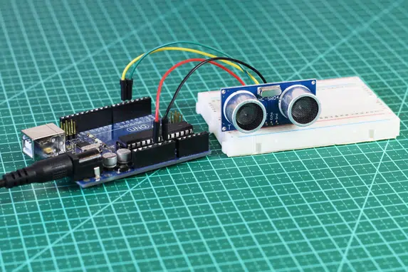
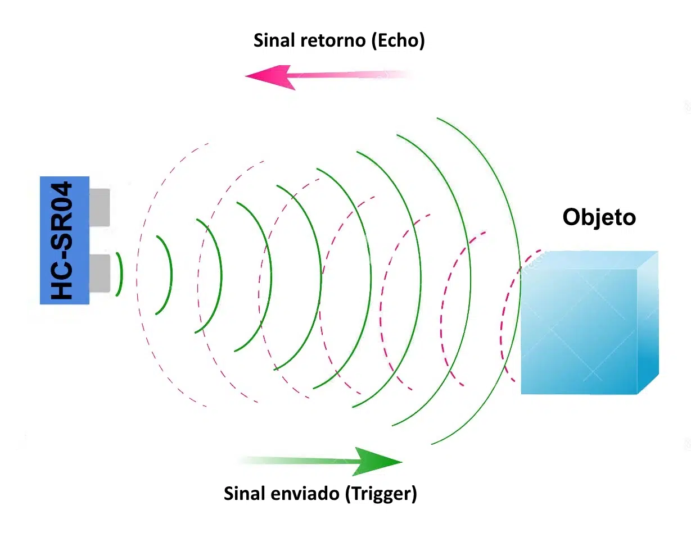
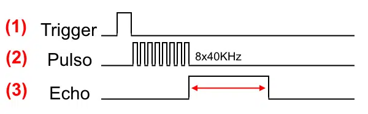
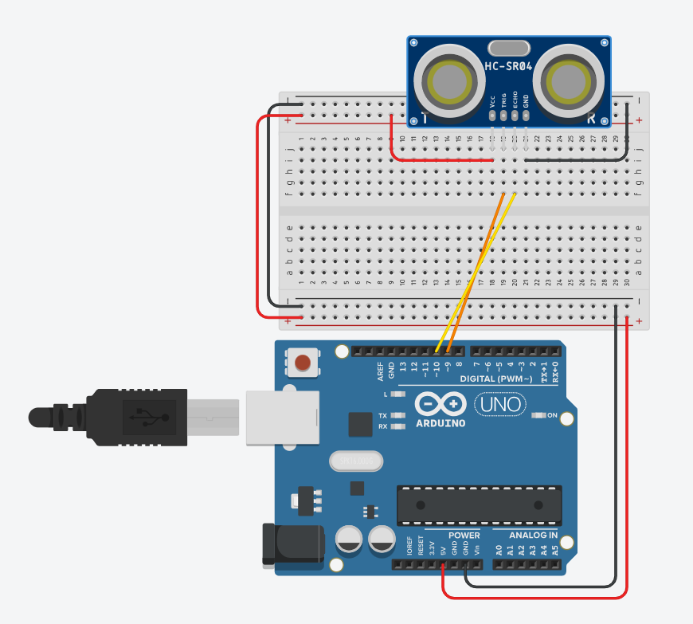
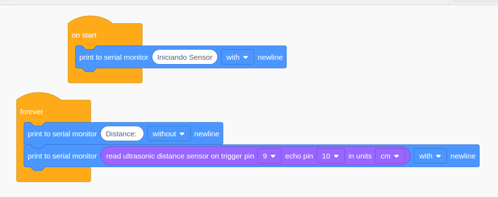
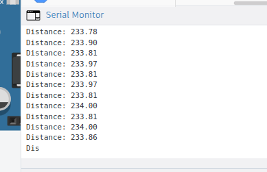

# Como conectar o Sensor Ultrassônico HC-SR04 ao Arduino
[^1]

O Sensor Ultrassônico HC-SR04 é um componente muito comum em projetos com Arduino, e permite que você faça leituras de distâncias entre 2 cm e 4 metros, com precisão de 3 mm. Pode ser utilizado simplesmente para medir a distância entre o sensor e um objeto, como para acionar portas do microcontrolador, desviar um robô de obstáculos, acionar alarmes, etc. Neste tutorial ensinaremos a conectar o HC-SR04 ao Arduino.




O funcionamento do HC-SR04 ([datasheet](https://www.makerhero.com/img/files/download/Datasheet_HCSR04.pdf)) se baseia no envio de sinais ultrassônicos pelo sensor, que aguarda o retorno (echo) do sinal, e com base no tempo entre envio e retorno, calcula a distância entre o sensor e o objeto detectado.



Primeiramente é enviado um pulso de 10µs, indicando o início da transmissão de dados. Depois disso, são enviado 8 pulsos de 40 KHz e o sensor então aguarda o retorno (em nível alto/high), para determinar a distância entre o sensor e o objeto, utilizando a equação `Distância = (Tempo echo em nível alto * velocidade do som) /2`



## Conectando o Sensor HC-SR04 ao Arduino

A ligação do sensor ao Arduino no nosso programa vai utilizar, além dos pinos de alimentação, os pinos digitais 4 para o Trigger, e 5 para o Echo. A alimentação será feita pelo pino 5V do Arduino:



código adaptado de [^2]

```c++
// C++ code
//
long readUltrasonicDistance(int triggerPin, int echoPin)
{
  pinMode(triggerPin, OUTPUT);  // Clear the trigger
  digitalWrite(triggerPin, LOW);
  delayMicroseconds(2);
  // Sets the trigger pin to HIGH state for 10 microseconds
  digitalWrite(triggerPin, HIGH);
  delayMicroseconds(10);
  digitalWrite(triggerPin, LOW);
  pinMode(echoPin, INPUT);
  // Reads the echo pin, and returns the sound wave travel time in microseconds
  return pulseIn(echoPin, HIGH);
}

void setup()
{
  Serial.begin(9600);

  Serial.println("Iniciando Sensor");
}

void loop()
{
  Serial.print("Distance: ");
  Serial.println(0.01723 * readUltrasonicDistance(9, 10));
  delay(10); // Delay a little bit to improve simulation performance
}
```

Bloco



No programa todo o cálculo é feito por meio da biblioteca Ultrasonic. O sensor é inicializado nos pinos trigger e echo, e depois efetuamos a leitura dos dados do sensor, atribuindo às variáveis cmMsec e inMsec os valores das distâncias em centímetros e polegadas, respectivamente. Os dados são mostrados no serial monitor:





<iframe width="725" height="453" src="https://www.tinkercad.com/embed/63VWQDvTt6H?editbtn=1" frameborder="0" marginwidth="0" marginheight="0" scrolling="no"></iframe>

## Exercício

Fazer o projeto do Tinkercad no Arduino e acender o led interno do arduino caso a distancia seja menor que 15cm.


## Referências


[^1]: https://www.makerhero.com/blog/sensor-ultrassonico-hc-sr04-ao-arduino/

[^2]: https://projecthub.arduino.cc/Isaac100/getting-started-with-the-hc-sr04-ultrasonic-sensor-7cabe1