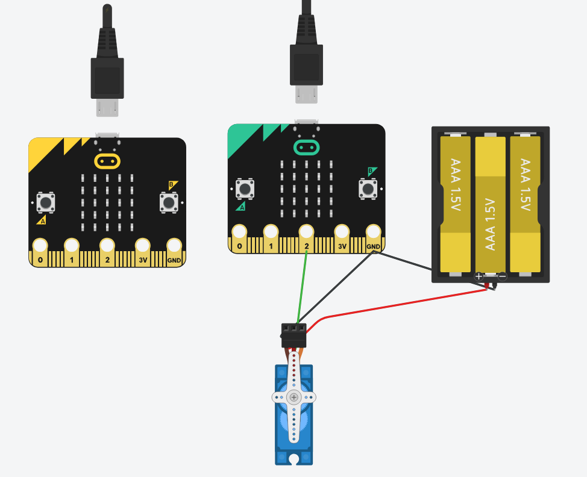

# Bluetooth na Robótica 

O uso do Bluetooth em projetos de robótica é uma prática comum e apresenta diversas vantagens. 

O Bluetooth é um padrão de comunicação sem fio que possibilita a troca de dados entre dispositivos em curtas distâncias. 

Na robótica, o Bluetooth é extremamente popular devido à sua facilidade de uso, baixo custo e ampla compatibilidade com dispositivos móveis. Ele permite a comunicação sem fio entre o robô e um controlador, como um smartphone ou tablet, possibilitando o controle remoto e a troca de dados em tempo real. 

Possibilita também a comunicação entre múltiplos dispositivos, o que é útil em projetos colaborativos ou em sistemas que envolvem vários robôs trabalhando juntos. Além disso, o Bluetooth é uma tecnologia amplamente adotada, o que significa que muitos projetos já utilizam essa tecnologia, facilitando a integração e o compartilhamento de conhecimento entre desenvolvedores.

## Vantagens do Bluetooth na Robótica 

1. **Facilidade de Uso**: A configuração e o emparelhamento de dispositivos Bluetooth são geralmente simples, tornando-o acessível para iniciantes em robótica.
2. **Baixo Custo**: Módulos Bluetooth são relativamente baratos, o que os torna uma opção econômica para projetos de robótica.
3. **Compatibilidade**: A maioria dos dispositivos móveis e computadores possuem suporte nativo para Bluetooth, facilitando a comunicação com o robô.
4. **Mobilidade**: A comunicação sem fio permite que o robô se mova livremente sem a necessidade de cabos, aumentando a flexibilidade do projeto.
5. **Baixo Consumo de Energia**: O Bluetooth é projetado para ser eficiente em termos de consumo de energia, o que é crucial para robôs alimentados por baterias.
6. **Comunicação em Tempo Real**: Permite o controle e a troca de dados em tempo real, essencial para muitas aplicações robóticas.
7. **Suporte a Múltiplos Dispositivos**: Facilita a comunicação entre vários dispositivos, útil em sistemas colaborativos.
8. **Segurança**: O Bluetooth oferece recursos de segurança, como criptografia e autenticação, para proteger a comunicação entre dispositivos.
9. **Ampla Adoção**: A popularidade do Bluetooth significa que há uma vasta comunidade de desenvolvedores e recursos disponíveis para suporte.
10. **Versatilidade**: Pode ser usado em uma variedade de aplicações, desde controle remoto até transmissão de dados sensoriais.
11. **Atualizações e Melhorias**: O Bluetooth continua a evoluir, com novas versões oferecendo melhorias em velocidade, alcance e eficiência energética.

## Exemplos de Aplicações do Bluetooth na Robótica  

Para exemplificar o uso do Bluetooth na robótica, podemos considerar o cenário de uma porta automatizada controlada por um dispositivo remoto via Bluetooth.

Neste exemplo, um módulo Bluetooth é conectado a um microcontrolador (nesse exemplo simulado por um Micro:Bit) que controla o motor responsável por abrir e fechar a porta. O usuário pode enviar comandos de um outro dispositivo (outro Micro:Bit) via Bluetooth para abrir ou fechar a porta.

O microcontrolador recebe os comandos do dispositivo remoto e aciona o motor conforme as instruções recebidas (abrir ou fechar). 

Segue exemplo de projeto no tinkercad utilizando Micro:Bit:

## Exercício Prático

Elabore um projeto simples utilizando Bluetooth para controlar um atuador (motor, servo, etc.) a partir de um dispositivo remoto. 

Ao ligar o sistema, o atuador deve estar na posição inicial (90 graus).

Quando o botão 1 do dispositivo remoto for pressionado, o atuador deve ser acionado e deve girar para 180 graus.

Quando o botão 2 do dispositivo remoto for pressionado, o atuador deve girar para 0 graus.