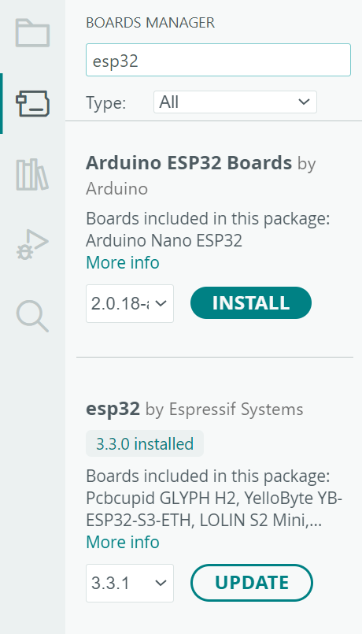

# Testando Bluetooth com ESP 32

A comunicação serial pelo Bluetooth pode enviar o comando "/led" para acender ou apagar o LED embarcado no ESP 32.

```c
//Baseado no exemplo de  Evandro Copercini - 2018

#include "BluetoothSerial.h"

#if !defined(CONFIG_BT_ENABLED) || !defined(CONFIG_BLUEDROID_ENABLED)
#error Bluetooth is not enabled! Please run `make menuconfig` to and enable it
#endif

#if !defined(CONFIG_BT_SPP_ENABLED)
#error Serial Bluetooth not available or not enabled. It is only available for the ESP32 chip.
#endif

String device_name = "ESP32BT_";
bool led = false;
BluetoothSerial SerialBT;

void setup() {
  Serial.begin(9600);
  randomSeed(esp_random());
  int random_number = random(1000, 9999);
  //int random_number = 4203;//remover comentario para definir um valor fixo
  device_name = device_name + String(random_number);

  pinMode(LED_BUILTIN, OUTPUT);
  digitalWrite(LED_BUILTIN, led);
  Serial.print("device_name: ");
  Serial.println(device_name);
  SerialBT.begin(device_name); //Bluetooth device name
}

void loop() {
  if (SerialBT.available()) {
    String texto = SerialBT.readStringUntil('\n');
    processaMensagem(texto);
  }
  delay(20);
}

void processaMensagem(String input){
  input.trim();
  input.toLowerCase();
  if (input == "/led") {
    led = !led;
    digitalWrite(LED_BUILTIN, led);
  }
}

```

## Serial Bluetooth Terminal

Utilizar o [Serial Bluetooth Terminal](https://play.google.com/store/apps/details?id=de.kai_morich.serial_bluetooth_terminal&hl=pt_BR) para conectar o smartphone ao ESP32

## Adicionar placa DOIT ESP32 DevKIT V1

- Open the Arduino IDE.
- Navigate to File > Preferences.
- In the "Additional Board Manager URLs" field, add the official ESP32 package URL:

```
https://dl.espressif.com/dl/package_esp32_index.json
```



Pinout no ESP


